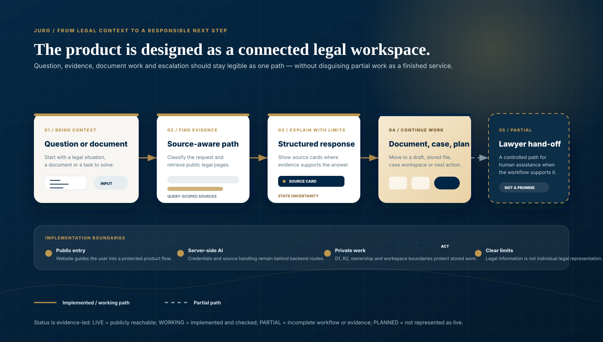
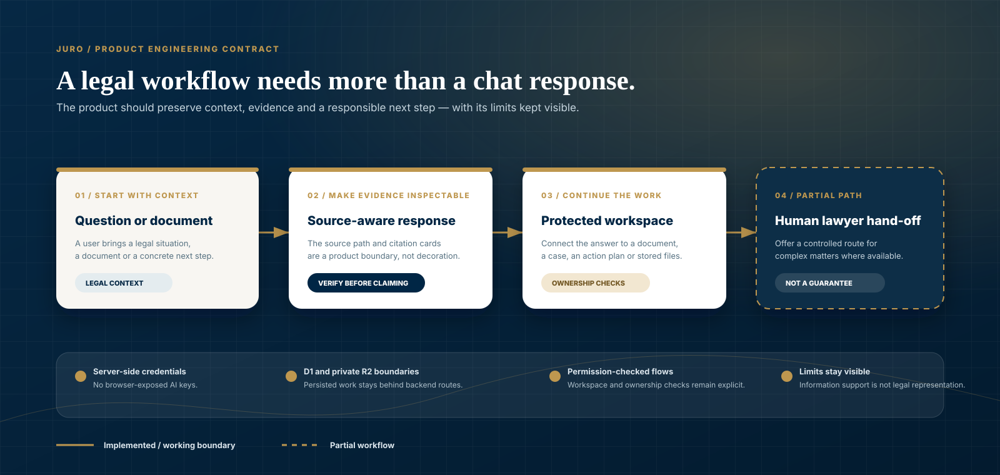

  

  <a href="README.md">English</a> · <a href="README.ru.md">Русский</a> · <a href="README.uz.md">O‘zbekcha</a>

  <a href="https://juro.uz">Live website</a> ·
  <a href="https://app.juro.uz">Open platform</a> ·
  <a href="#how-it-works">How it works</a> ·
  <a href="#product-experience">Product experience</a> ·
  <a href="#architecture">Architecture</a> ·
  <a href="#quick-start">Quick start</a>

 

  

**Legal intelligence for real next steps.**

Source-aware legal information · protected document workflows · case and action work · human lawyer hand-off where the workflow supports it

JURO is a LegalTech workspace for Uzbekistan. It is designed for people and teams who need to move from a legal question or document toward a clear, traceable next step—without presenting AI output as a substitute for individual legal advice.

The live public entry is [juro.uz](https://juro.uz); the protected product platform is [app.juro.uz](https://app.juro.uz). This repository is the product dossier and engineering record for the public site, platform, administrative surface, Cloudflare configuration and release checks.

## Product at a glance

| Product direction | What is present in the repository | Status boundary |
|---|---|---|
| Legal information | A source-aware answer path and citation surfaces for query-scoped public legal pages. | WORKING — this is not an official source-provider API or a claim of a complete corpus. |
| Documents and work | Document drafts, generated-file paths, cases, tasks and action-plan workflows. | WORKING — availability can depend on the protected account and deployment state. |
| Legal review | Document review and comparison interfaces with citation-oriented boundaries. | PARTIAL — fresh authenticated end-to-end verification is still required. |
| Human assistance | Lawyer profiles, directory and hand-off lifecycle surfaces. | PARTIAL — not a guarantee of representation or a completed consultation. |
| Delivery platform | Public website, protected platform and a separate administrative app in one monorepo. | LIVE / WORKING / PARTIAL as detailed in the status matrix below. |

> **Why this presentation is evidence-led:** JURO does not publish audience, accuracy, revenue, corpus-size or legal-outcome claims without a reproducible repository source. A green technical check is likewise not presented as a legal-quality or production-release guarantee.

## How it works

The implemented legal-information path starts with a question or document, identifies the request, retrieves relevant public-source pages, assembles bounded context and presents a structured response with source cards when evidence is available. Its public-source layer is query-scoped retrieval from Lex.uz and Advice.uz pages; JURO does not claim an official third-party API integration.

An answer is useful only when its boundary is clear:

| What JURO aims to make visible | Repository evidence | What it deliberately does not promise |
|---|---|---|
| The source associated with a response | [`direct-citation-store.ts`](apps/platform/lib/legal/direct-citation-store.ts) stores direct citations against an AI run. | A source page alone does not turn an answer into individual legal advice. |
| A controlled public-source retrieval path | [`direct-retrieval.ts`](apps/platform/lib/legal/direct-retrieval.ts) contains direct retrieval and citation-eligibility logic. | Official-provider access, complete coverage or infallible retrieval. |
| Citation boundaries in document review | [`document-analysis/schema.ts`](apps/platform/lib/document-analysis/schema.ts) rejects certain legal findings, risks and missing clauses without citations. | A completed end-to-end review claim; that surface remains PARTIAL. |
| A route to human review | Lawyer-profile and hand-off code lives in [`apps/platform`](apps/platform). | An automatic consultation, representation or outcome. |

For the engineering rationale and code map, read [Product foundations](docs/github/PRODUCT_FOUNDATIONS.md).

## Product experience

| Public entry | Protected workspace |
|---|---|
|  |  |
| Begin with a legal situation, document or next action. | Keep legal work, documents and next steps in one protected workspace. |

| Source-aware question flow | Document builder |
|---|---|
|  |  |
| The product asks for context and makes source availability explicit. | Start a structured draft from a document workflow. |

| Review and compare surface | Narrow public-product view |
|---|---|
|  |  |
| The interface exists; its end-to-end legal analysis status is PARTIAL. | A narrow presentation capture of the live public product, not mobile-QA evidence. |

## From legal context to practical work

JURO is shaped as a connected workflow, not an isolated chat screen. A person can begin with context, follow the available source evidence, continue in a protected work area and—where the current surface permits—request human assistance.

| Transition | Current status | Boundary kept visible |
|---|---|---|
| Public legal-intelligence entry → protected platform | LIVE | The public website and platform are deployed at separate public domains. |
| Question → structured source-aware response | WORKING | A response should show its evidence or communicate that it is limited. |
| Response → document, case or action work | WORKING | Workflows are implemented in the protected platform; not every route is necessarily enabled for every account. |
| Complex matter → lawyer hand-off | PARTIAL | The workflow exists in code, but is not positioned as guaranteed representation. |

## Product ecosystem

The diagram distinguishes the current core from partial and planned surfaces. Solid connections denote implemented or working repository paths; dashed connections show PARTIAL or PLANNED product work.

## Architecture

JURO is a monorepo with independently deployable public and protected applications:

- `apps/website` powers the public website through React, Next.js, Vite/Vinext and Cloudflare Worker tooling.
- `apps/platform` provides protected route handlers, document workflows, authorization boundaries and generated-file flows.
- `apps/admin` is a separate Worker-based administrative surface and remains PARTIAL.
- Cloudflare D1 and private R2 back persisted platform data and files; OpenAI configuration remains server-side.
- The platform supports DOCX, PDF and ZIP generation. Email/OTP is configured through server-side provider settings when enabled.

## Trust, privacy and legal safety

The repository makes several operating boundaries inspectable: server-side credentials, backend-mediated D1/R2 access, protected ownership or workspace checks, source display and clear limitations around AI output. No GDPR, ISO, SOC 2, data-residency or other certification claim is made here.

Report a vulnerability privately through [SECURITY.md](SECURITY.md). Do not put secrets, personal data, user documents or production logs in an issue or pull request.

## Current status

| Area | Status | Notes |
|---|---|---|
| Public website | LIVE | [juro.uz](https://juro.uz) was reachable during the documentation audit. |
| Protected platform entry | LIVE | [app.juro.uz](https://app.juro.uz) is reachable and serves protected product routes. |
| AI legal-information flow | WORKING | Source-aware response and citation surfaces are implemented; broader legal evaluation is a separate release gate. |
| Document builder | WORKING | Persisted document workflows, private storage and generated-file paths are implemented. |
| Document analysis and comparison | PARTIAL | Review and comparison surfaces exist; fresh authenticated end-to-end evidence is not complete. |
| Cases and action plans | WORKING | Case, task and action-plan workflows are implemented. |
| Lawyer directory and consultations | PARTIAL | Controlled profiles, directory and hand-off lifecycle work is incomplete. |
| Administration | PARTIAL | A separate admin Worker and protected administrative flows exist. |
| Production payments | PLANNED | No live payment provider is claimed in this repository. |

## Repository map

    juro/
    ├── apps/
    │   ├── website/       # juro.uz public website
    │   ├── platform/      # app.juro.uz and legal workflows
    │   └── admin/         # separate administrative Worker
    ├── docs/              # architecture, migrations and operations
    ├── .github/           # CI, contribution and issue templates
    ├── .env.example       # configuration names only; no secrets
    ├── SECURITY.md
    ├── package.json
    └── README.md

## Quick start

### Requirements

- Node.js 22.13 or later.
- npm compatible with the committed lockfiles.
- Bash and documented POSIX tools for the legacy `apps/website` lifecycle; `apps/platform` uses shell-neutral Node launchers.
- Cloudflare-compatible bindings for persisted platform features.

Clone and install the website and platform:

    git clone https://github.com/MoozUpus/juro.git
    cd juro
    npm run install:all

Run locally:

    npm run dev:website
    npm run dev:platform
    npm run dev:admin

Copy `.env.example` to a local ignored environment file. Never commit `.env` files, API keys, access tokens, database exports, user documents or logs.

Environment variables and Cloudflare bindings

| Name | Required | Scope | Purpose |
|---|---:|---|---|
| `OPENAI_API_KEY` | For live AI only | Server | OpenAI Responses API authentication |
| `OPENAI_MODEL` | No | Server | Optional model override |
| `RESEND_API_KEY` | For email OTP | Server | Email-provider authentication |
| `EMAIL_FROM` | For email OTP | Server | Verified sender address |
| `JURO_SMOKE_BASE_URL` | No | Test process | Document-builder smoke-test base URL |
| `CLOUDFLARE_REMOTE_BINDINGS` | No | Local development | Opt in to remote bindings; requires Wrangler login |
| `DB` | Persisted features | Worker binding | Cloudflare D1 |
| `BUCKET` | File workflows | Worker binding | Private Cloudflare R2 |
| `ASSETS` / `IMAGES` | Hosting managed | Worker binding | Static assets and image optimization |

`DB`, `BUCKET`, `ASSETS` and `IMAGES` are platform bindings, not secrets to place in an environment file. AI and email keys are server-only configuration and must never be exposed through public browser variables.

## Quality and testing

From the repository root:

    npm run lint
    npm run type-check
    npm test
    npm run build
    npm run validate:artifact

CI is defined in [.github/workflows/ci.yml](.github/workflows/ci.yml). It covers locked installs, linting, TypeScript checks, tests, artifact validation and the platform Cloudflare environment matrix. For platform-only matrix and dry-run coverage, use:

    npm --prefix apps/platform run validate:cloudflare:matrix

## Deployment

Website and platform deployments are intentionally independent. The platform needs D1 migrations, private R2 bindings, server-side secrets and explicit permission checks; both targets should be preview-tested before any production approval.

Read [docs/DEPLOYMENT.md](docs/DEPLOYMENT.md) for the release sequence, rollback expectations, DNS safeguards and backup requirements. [docs/MIGRATION.md](docs/MIGRATION.md) retains the source-migration and alternative-hosting audit.

## Roadmap

| Now | Next | Later |
|---|---|---|
| Maintain source-aware information, document workflows, permissions and release evidence. | Complete authenticated verification of document analysis and lawyer hand-off. | Consider payments and wider ecosystem integrations only after their product, security and operational gates are approved. |

## Contributing and license

JURO is a product-managed repository. Focused, safe contributions are welcome; see [.github/CONTRIBUTING.md](.github/CONTRIBUTING.md) and use the supplied issue and pull-request templates. A pull request does not authorize a production deployment, DNS change or access to production data.

No license file is currently included. Reuse rights have not been granted here; contact the repository owner before using code or presentation assets.

---

Presentation-asset provenance and update rules: [docs/github/README_ASSETS.md](docs/github/README_ASSETS.md).
