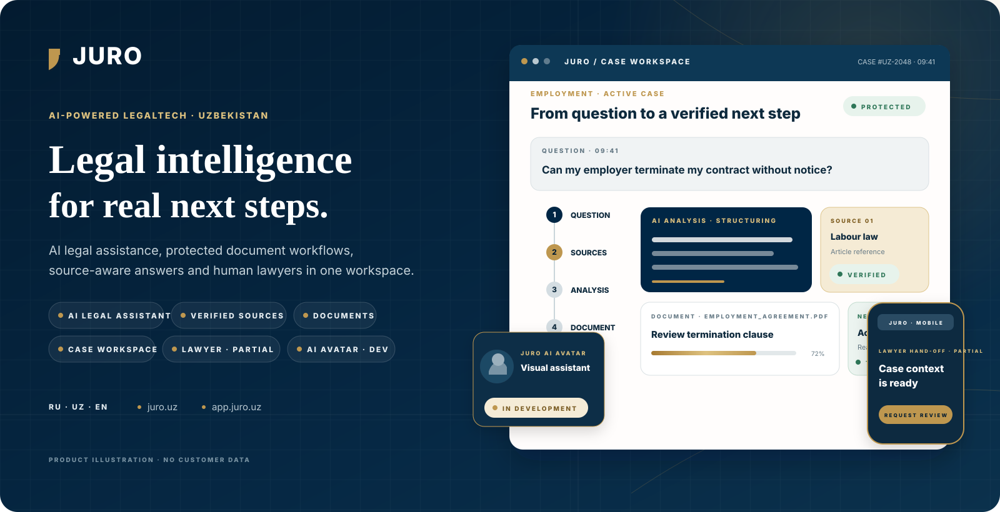
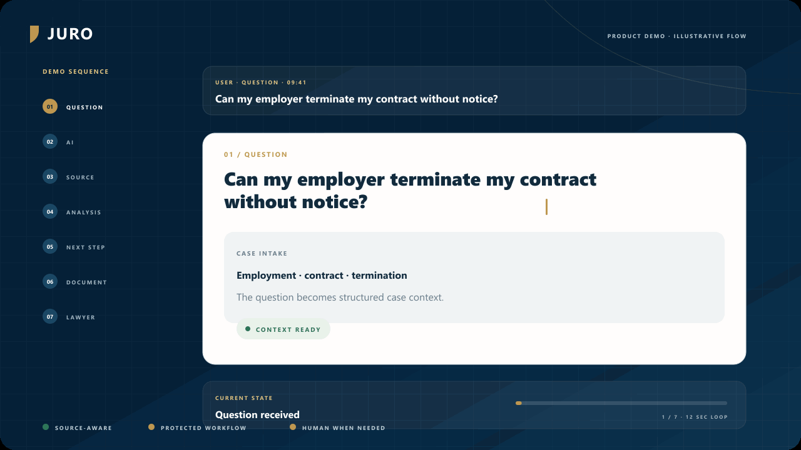
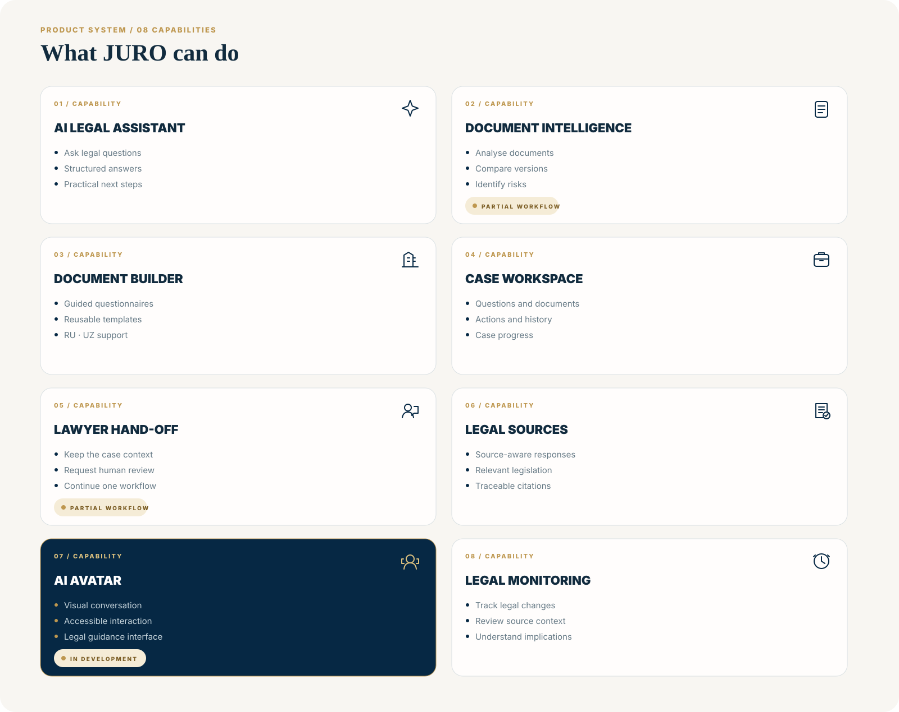
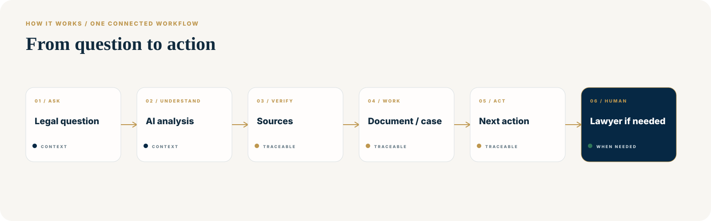
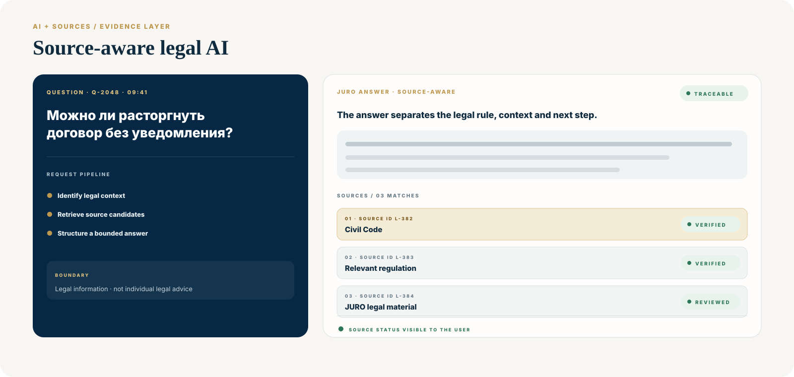
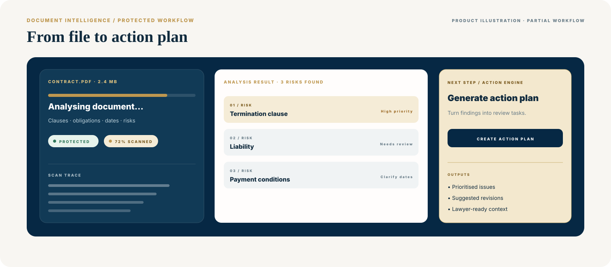
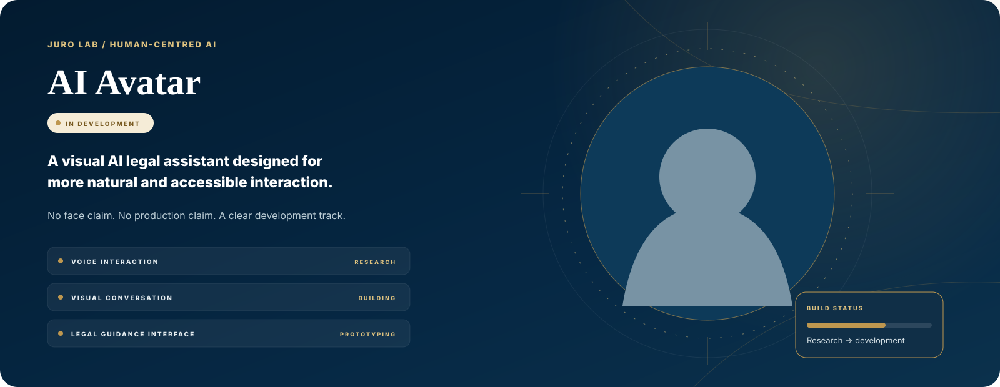
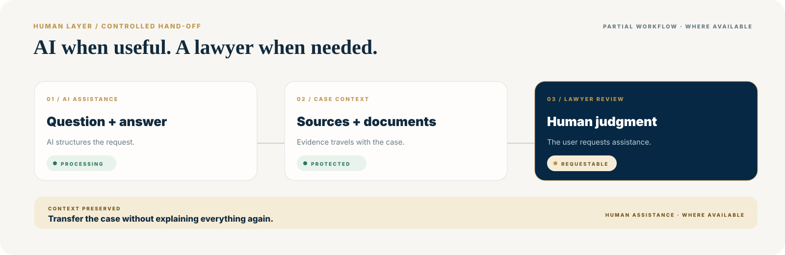
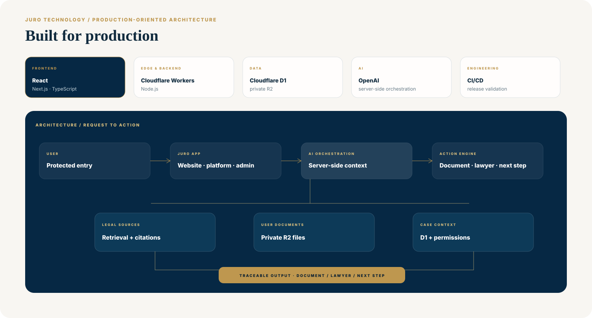

<picture>
  <source media="(max-width: 900px)" srcset="docs/github/showcase/hero-en-mobile.svg">
  
</picture>

  <strong>English</strong> · <a href="README.ru.md">Русский</a> · <a href="README.uz.md">O‘zbekcha</a>

  <a href="https://juro.uz"><strong>juro.uz</strong></a> ·
  <a href="https://app.juro.uz"><strong>Open platform</strong></a> ·
  <a href="#product-demo">Product demo</a> ·
  <a href="#how-it-works">How it works</a> ·
  <a href="#product-experience">Product experience</a> ·
  <a href="#architecture">Architecture</a> ·
  <a href="#quick-start">Quick start</a>

 

  <strong>Legal intelligence for real next steps.</strong> 
  AI legal assistance · source-aware answers · protected document workflows · cases · human lawyer hand-off

JURO is a multilingual LegalTech workspace built for Uzbekistan with international product and engineering standards. It connects legal questions, source evidence, documents, cases and practical next steps in one protected product environment—not a disconnected AI chat.

> **Product boundary:** the visuals below are original JURO product illustrations and contain no customer data. They explain implemented and developing workflows; they are not presented as live screenshots or a substitute for individual legal advice. AI Avatar is explicitly **IN DEVELOPMENT**.

## Product demo

<picture>
  <source media="(prefers-reduced-motion: reduce) and (max-width: 900px)" srcset="docs/github/showcase/product-demo-mobile-poster.svg">
  <source media="(prefers-reduced-motion: reduce)" srcset="docs/github/showcase/product-demo-poster.svg">
  <source media="(max-width: 900px)" srcset="docs/github/showcase/product-demo-mobile.gif">
  
</picture>

The 12.6-second loop shows the intended connected flow: **question → analysis → source → legal context → next step → document → lawyer**. The demo uses only repository-local assets; a static poster is served when reduced motion is preferred.

## What JURO can do

<picture>
  <source media="(max-width: 900px)" srcset="docs/github/showcase/capability-board-mobile.svg">
  
</picture>

JURO brings multiple legal-work surfaces into one system. Availability still depends on account permissions and deployment state; the evidence-led status matrix below remains the source of truth for LIVE, WORKING, PARTIAL and IN DEVELOPMENT boundaries.

## How it works

<picture>
  <source media="(max-width: 900px)" srcset="docs/github/showcase/question-to-action-mobile.svg">
  
</picture>

The product is designed around progression, not chat volume: collect the right context, make source evidence visible, keep work protected and turn the result into a practical action. Human assistance remains an explicit step when the current workflow and availability permit it.

## AI that shows its sources

<picture>
  <source media="(max-width: 900px)" srcset="docs/github/showcase/source-aware-ai-mobile.svg">
  
</picture>

JURO’s legal-information path keeps the evidence boundary visible. Query-scoped retrieval, citation eligibility and persisted direct citations are implemented in [direct-retrieval.ts](apps/platform/lib/legal/direct-retrieval.ts) and [direct-citation-store.ts](apps/platform/lib/legal/direct-citation-store.ts). The public-source path retrieves relevant Lex.uz and Advice.uz pages; JURO does not claim an official provider API, complete legal coverage or that a source page turns AI output into individual legal advice.

## Document intelligence

<picture>
  <source media="(max-width: 900px)" srcset="docs/github/showcase/document-intelligence-mobile.svg">
  
</picture>

Document review, comparison, versioning and action-plan surfaces exist in the protected platform. The illustration communicates the workflow, not a claim that every analysis path has completed fresh authenticated end-to-end verification; the status remains **PARTIAL** where the matrix says so.

## AI Avatar — In Development

<picture>
  <source media="(max-width: 900px)" srcset="docs/github/showcase/ai-avatar-mobile.svg">
  
</picture>

JURO is developing a visual AI legal assistant for more natural and accessible interaction. The repository does **not** claim a production avatar, approved rigged character, live lip-sync or a completed voice path. Research, interface prototyping and asset approval remain development work.

## Human lawyer hand-off

<picture>
  <source media="(max-width: 900px)" srcset="docs/github/showcase/lawyer-handoff-mobile.svg">
  
</picture>

The hand-off model is simple: preserve the question, sources, documents and action history so a user can request human assistance without rebuilding the case from zero. It is a controlled product workflow—not a guarantee of representation, availability or legal outcome.

## Built for production

<picture>
  <source media="(max-width: 900px)" srcset="docs/github/showcase/technology-architecture-mobile.svg">
  
</picture>

The monorepo separates public, protected and administrative surfaces while keeping credentials and data access behind server boundaries. React, Next.js and TypeScript power the frontend; Cloudflare Workers, Node.js, D1 and private R2 support the runtime and data layer; OpenAI configuration remains server-side; CI/CD and artifact checks support release discipline.

## Product experience

These are repository-maintained product captures without customer data. They complement the explanatory compositions above with real product surfaces.

| Public product | Protected workspace |
|---|---|
|  |  |
| **Public website** · multilingual entry and product explanation | **Workspace** · cases, documents, actions and account-scoped navigation |

| AI legal information | Document builder |
|---|---|
|  |  |
| **AI + sources** · structured response and evidence surfaces | **Documents** · library, guided builder and generated-file paths |

| Document review | Mobile product entry |
|---|---|
|  |  |
| **Review** · analysis and comparison entry (**PARTIAL**) | **Responsive experience** · narrow public-product preview |

## Architecture and product boundaries

JURO is a monorepo with independently deployable surfaces:

- apps/website powers the public website through React, Next.js, Vite/Vinext and Cloudflare Worker tooling.
- apps/platform provides protected route handlers, AI evidence, document workflows, cases, authorization boundaries and generated-file flows.
- apps/admin is a separate Worker-based administrative surface and remains **PARTIAL**.
- Cloudflare D1 and private R2 back persisted platform data and files; AI and email configuration remain server-side.
- The platform includes DOCX, PDF and ZIP generation paths; email/OTP delivery uses server-side provider configuration when enabled.

Solid connections denote implemented or working repository paths; dashed connections preserve PARTIAL or PLANNED boundaries. For the engineering rationale and code map, read [Product foundations](docs/github/PRODUCT_FOUNDATIONS.md).

## Trust, privacy and legal safety

The repository keeps several operating boundaries inspectable: server-side credentials, backend-mediated D1/R2 access, ownership and workspace checks, source display, and explicit limitations around AI output. No GDPR, ISO, SOC 2, data-residency or legal-outcome claim is made here.

Report a vulnerability privately through [SECURITY.md](SECURITY.md). Do not put secrets, personal data, user documents or production logs in an issue or pull request.

## Current status

| Area | Status | Notes |
|---|---|---|
| Public website | LIVE | [juro.uz](https://juro.uz) returned HTTP 200 on 2026-09-10. |
| Protected platform entry | LIVE | [app.juro.uz](https://app.juro.uz) returned HTTP 200 and redirected to the localized protected login on 2026-09-10. |
| AI legal-information flow | WORKING | Source-aware response and citation surfaces are implemented; broader legal evaluation is a separate release gate. |
| Document builder | WORKING | Persisted document workflows, private storage and generated-file paths are implemented. |
| Document analysis and comparison | PARTIAL | Review and comparison surfaces exist; fresh authenticated end-to-end evidence is not complete. |
| Cases and action plans | WORKING | Case, task and action-plan workflows are implemented. |
| Lawyer directory and consultations | PARTIAL | Controlled profiles, directory and hand-off lifecycle work is incomplete. |
| AI Avatar | IN DEVELOPMENT | The visual assistant is a declared development track; no production avatar, approved rigged character or completed live voice path is claimed. |
| Administration | PARTIAL | A separate admin Worker and protected administrative flows exist. |
| Production payments | PLANNED | No live payment provider is claimed in this repository. |

## Repository map

    juro/
    ├── apps/
    │   ├── website/       # juro.uz public website
    │   ├── platform/      # app.juro.uz and legal workflows
    │   └── admin/         # separate administrative Worker
    ├── docs/              # architecture, migrations and operations
    ├── .github/           # CI, contribution and issue templates
    ├── .env.example       # configuration names only; no secrets
    ├── SECURITY.md
    ├── package.json
    └── README.md

## Quick start

### Requirements

- Node.js 22.13 or later.
- npm compatible with the committed lockfiles.
- Bash and documented POSIX tools for the legacy `apps/website` lifecycle; `apps/platform` uses shell-neutral Node launchers.
- Cloudflare-compatible bindings for persisted platform features.

Clone and install the website and platform:

    git clone https://github.com/MoozUpus/juro.git
    cd juro
    npm run install:all

Run locally:

    npm run dev

The default command starts the platform with a loopback-only developer login
and its legal retrieval service bound read-only to the current production
corpus. Run `wrangler login` once before the first start. Legal questions leave
the local machine for retrieval; do not use private client facts in local
testing. The remote corpus can incur Cloudflare and AI-provider usage charges.

Other applications can be started explicitly:

    npm run dev:website
    npm run dev:platform
    npm run dev:admin

Copy `.env.example` to a local ignored environment file. Never commit `.env` files, API keys, access tokens, database exports, user documents or logs.

Environment variables and Cloudflare bindings

| Name | Required | Scope | Purpose |
|---|---:|---|---|
| `OPENAI_API_KEY` | For live AI only | Server | OpenAI Responses API authentication |
| `OPENAI_MODEL` | No | Server | Optional model override |
| `RESEND_API_KEY` | For email OTP | Server | Email-provider authentication |
| `EMAIL_FROM` | For email OTP | Server | Verified sender address |
| `JURO_SMOKE_BASE_URL` | No | Test process | Document-builder smoke-test base URL |
| `CLOUDFLARE_REMOTE_BINDINGS` | No | Local development | Opt additional supported bindings into remote mode; the read-only production legal corpus service is remote by default and requires Wrangler login |
| `DB` | Persisted features | Worker binding | Cloudflare D1 |
| `BUCKET` | File workflows | Worker binding | Private Cloudflare R2 |
| `ASSETS` / `IMAGES` | Hosting managed | Worker binding | Static assets and image optimization |

`DB`, `BUCKET`, `ASSETS` and `IMAGES` are platform bindings, not secrets to place in an environment file. AI and email keys are server-only configuration and must never be exposed through public browser variables.

## Quality and testing

From the repository root:

    npm run lint
    npm run type-check
    npm test
    npm run build
    npm run validate:artifact

CI is defined in [.github/workflows/ci.yml](.github/workflows/ci.yml). It covers locked installs, linting, TypeScript checks, tests, artifact validation and the platform Cloudflare environment matrix. For platform-only matrix and dry-run coverage, use:

    npm --prefix apps/platform run validate:cloudflare:matrix

## Deployment

Website and platform deployments are intentionally independent. The platform needs D1 migrations, private R2 bindings, server-side secrets and explicit permission checks; both targets should be preview-tested before any production approval.

Read [docs/DEPLOYMENT.md](docs/DEPLOYMENT.md) for the release sequence, rollback expectations, DNS safeguards and backup requirements. [docs/MIGRATION.md](docs/MIGRATION.md) retains the source-migration and alternative-hosting audit.

## Roadmap

| Now | Next | Later |
|---|---|---|
| Maintain source-aware information, document workflows, permissions and release evidence. | Complete authenticated verification of document analysis and lawyer hand-off. | Consider payments and wider ecosystem integrations only after their product, security and operational gates are approved. |

## Contributing and license

JURO is a product-managed repository. Focused, safe contributions are welcome; see [.github/CONTRIBUTING.md](.github/CONTRIBUTING.md) and use the supplied issue and pull-request templates. A pull request does not authorize a production deployment, DNS change or access to production data.

No license file is currently included. Reuse rights have not been granted here; contact the repository owner before using code or presentation assets.

---

Presentation-asset provenance and update rules: [docs/github/README_ASSETS.md](docs/github/README_ASSETS.md).
