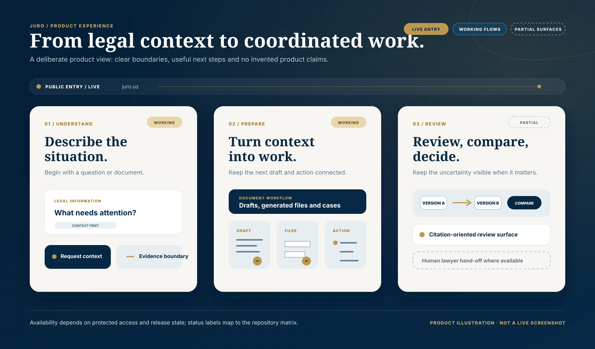

  

  <a href="README.md">English</a> · <a href="README.ru.md">Русский</a> · <a href="README.uz.md">O‘zbekcha</a>

  <a href="https://juro.uz">Сайт</a> ·
  <a href="https://app.juro.uz">Открыть платформу</a> ·
  <a href="#как-это-работает">Как это работает</a> ·
  <a href="#продуктовый-опыт">Продуктовый опыт</a> ·
  <a href="#архитектура">Архитектура</a> ·
  <a href="#быстрый-старт">Быстрый старт</a>

 

  

**Юридическая информация — чтобы переходить к реальным следующим шагам.**

Информация с привязкой к источникам · защищённая работа с документами · дела и планы действий · передача юристу там, где это поддерживает сценарий

JURO — LegalTech-пространство для Узбекистана. Оно помогает человеку или команде перейти от юридического вопроса либо документа к понятному, прослеживаемому следующему действию — не выдавая результат AI за замену индивидуальной юридической консультации.

Публичная точка входа доступна на [juro.uz](https://juro.uz), защищённая продуктовая платформа — на [app.juro.uz](https://app.juro.uz). Этот репозиторий — продуктовое досье и инженерный журнал для публичного сайта, платформы, административной поверхности, конфигурации Cloudflare и проверок релиза.

## В двух словах о продукте

| Направление | Что есть в репозитории | Граница статуса |
|---|---|---|
| Юридическая информация | Путь source-aware ответа и поверхности citations для публичных правовых страниц, выбранных в рамках конкретного запроса. | WORKING — это не официальный API провайдеров источников и не заявление о полном корпусе. |
| Документы и работа | Черновики, пути генерации файлов, дела, задачи и планы действий. | WORKING — доступность может зависеть от защищённого аккаунта и состояния развёртывания. |
| Юридическая проверка | Интерфейсы review и сравнения документов с требованиями к ссылкам. | PARTIAL — требуется новое аутентифицированное end-to-end подтверждение. |
| Помощь человека | Профили юристов, каталог и lifecycle передачи вопроса. | PARTIAL — это не гарантия представительства или завершённой консультации. |
| Платформа доставки | Публичный сайт, защищённая платформа и отдельное административное приложение в одном монорепозитории. | LIVE / WORKING / PARTIAL — подробности приведены в матрице ниже. |

> **Почему эта подача опирается на доказательства:** JURO не публикует показатели аудитории, точности, выручки, размера корпуса или юридических результатов без воспроизводимого источника в репозитории. Зелёная техническая проверка также не выдаётся за гарантию юридического качества или production-релиза.

## Как это работает

Реализованный путь юридической информации начинается с вопроса или документа, определяет тип запроса, получает релевантные публичные страницы-источники, собирает ограниченный контекст и показывает структурированный ответ с карточками источников при наличии подтверждений. Публичный слой использует query-scoped получение страниц Lex.uz и Advice.uz; JURO не заявляет официальную интеграцию с API третьих сторон.

Ответ полезен только тогда, когда его граница очевидна:

| Что JURO стремится сделать видимым | Подтверждение в репозитории | Чего продукт сознательно не обещает |
|---|---|---|
| Источник, связанный с ответом | [`direct-citation-store.ts`](apps/platform/lib/legal/direct-citation-store.ts) сохраняет прямые citations для AI-run. | Одна страница-источник не превращает ответ в персональную юридическую консультацию. |
| Контролируемый путь получения публичного источника | [`direct-retrieval.ts`](apps/platform/lib/legal/direct-retrieval.ts) содержит логику получения и eligibility цитирования. | Официальный доступ к провайдеру, полное покрытие или безошибочный retrieval. |
| Границы ссылок при review документа | [`document-analysis/schema.ts`](apps/platform/lib/document-analysis/schema.ts) отклоняет часть legal findings, risks и missing clauses без citations. | Завершённый end-to-end review: поверхность остаётся PARTIAL. |
| Путь к человеческой проверке | Код профилей и hand-off юристу находится в [`apps/platform`](apps/platform). | Автоматическую консультацию, представительство или результат. |

Инженерское обоснование и карту кода см. в [Product foundations](docs/github/PRODUCT_FOUNDATIONS.md).

## Продуктовый опыт

Это продуктовая иллюстрация, а не заявление о живом интерфейсе. Публичная точка входа — [juro.uz](https://juro.uz); защищённые workflows доступны через [app.juro.uz](https://app.juro.uz). Статусы на схеме соответствуют матрице репозитория: юридическая информация и работа с документами — WORKING, а review документов и передача юристу остаются PARTIAL.

## От юридического контекста к работе

JURO строится как связанный workflow, а не как отдельный экран чата. Пользователь может начать с контекста, посмотреть доступные подтверждения в источниках, продолжить работу в защищённой зоне и — где это разрешает текущий сценарий — запросить человеческую помощь.

| Переход | Текущий статус | Открыто обозначенная граница |
|---|---|---|
| Публичная точка legal intelligence → защищённая платформа | LIVE | Публичный сайт и платформа развёрнуты на отдельных доменах. |
| Вопрос → структурированный source-aware ответ | WORKING | Ответ должен показать основание либо сообщить об ограничении. |
| Ответ → документ, дело или план действий | WORKING | Workflows реализованы в защищённой платформе; отдельный маршрут может быть недоступен конкретному аккаунту. |
| Сложный вопрос → передача юристу | PARTIAL | Workflow есть в коде, но не позиционируется как гарантированное представительство. |

## Экосистема продукта

Схема отделяет текущее ядро от частичных и планируемых поверхностей. Сплошные соединения обозначают реализованные или working пути в репозитории; пунктирные — PARTIAL или PLANNED работу.

## Архитектура

JURO — монорепозиторий с независимо развёртываемыми публичными и защищёнными приложениями:

- `apps/website` обслуживает публичный сайт через React, Next.js, Vite/Vinext и Cloudflare Worker tooling.
- `apps/platform` содержит защищённые route handlers, document workflows, границы authorization и generated-file flows.
- `apps/admin` — отдельная Worker-based административная поверхность, которая остаётся PARTIAL.
- Cloudflare D1 и private R2 поддерживают сохранённые данные платформы и файлы; конфигурация OpenAI остаётся на сервере.
- Платформа поддерживает генерацию DOCX, PDF и ZIP. При включении email/OTP настраивается через server-side provider settings.

## Доверие, приватность и юридическая безопасность

В репозитории можно проверить ключевые границы: credentials на сервере, D1/R2 только через backend, защищённые проверки ownership или workspace, отображение источников и ясные ограничения AI-результата. Здесь не заявляются GDPR, ISO, SOC 2, data residency или иные сертификации.

Сообщайте об уязвимостях приватно согласно [SECURITY.md](SECURITY.md). Не добавляйте secrets, персональные данные, пользовательские документы или production logs в issue или pull request.

## Текущий статус

| Область | Статус | Примечание |
|---|---|---|
| Публичный сайт | LIVE | [juro.uz](https://juro.uz) открывался во время аудита документации. |
| Вход в защищённую платформу | LIVE | [app.juro.uz](https://app.juro.uz) доступен и обслуживает защищённые маршруты продукта. |
| AI-путь юридической информации | WORKING | Реализованы source-aware ответ и citation surfaces; расширенная legal evaluation — отдельный release gate. |
| Конструктор документов | WORKING | Реализованы persisted workflows, private storage и generated-file paths. |
| Анализ и сравнение документов | PARTIAL | Поверхности review и compare есть, но свежие аутентифицированные end-to-end доказательства не завершены. |
| Дела и планы действий | WORKING | Реализованы case, task и action-plan workflows. |
| Каталог юристов и консультации | PARTIAL | Controlled profiles, каталог и lifecycle hand-off ещё не завершены. |
| Администрирование | PARTIAL | Есть отдельный admin Worker и защищённые административные flows. |
| Production-платежи | PLANNED | В репозитории не заявлен live payment provider. |

## Карта репозитория

    juro/
    ├── apps/
    │   ├── website/       # публичный сайт juro.uz
    │   ├── platform/      # app.juro.uz и юридические workflows
    │   └── admin/         # отдельный administrative Worker
    ├── docs/              # архитектура, миграции и operations
    ├── .github/           # CI, contribution и issue templates
    ├── .env.example       # только имена конфигурации, без secrets
    ├── SECURITY.md
    ├── package.json
    └── README.md

## Быстрый старт

### Требования

- Node.js 22.13 или новее.
- npm, совместимый с committed lockfiles.
- Bash и описанные POSIX-инструменты для legacy lifecycle `apps/website`; `apps/platform` использует shell-neutral Node launchers.
- Cloudflare-compatible bindings для persisted возможностей платформы.

Клонируйте и установите website и platform:

    git clone https://github.com/MoozUpus/juro.git
    cd juro
    npm run install:all

Запустите локально:

    npm run dev:website
    npm run dev:platform
    npm run dev:admin

Скопируйте `.env.example` в локальный ignored environment file. Никогда не коммитьте `.env`, API keys, access tokens, database exports, пользовательские документы или logs.

Переменные окружения и Cloudflare bindings

| Имя | Требуется | Scope | Назначение |
|---|---:|---|---|
| `OPENAI_API_KEY` | Только для live AI | Server | Аутентификация OpenAI Responses API |
| `OPENAI_MODEL` | Нет | Server | Необязательная замена модели |
| `RESEND_API_KEY` | Для email OTP | Server | Аутентификация email-провайдера |
| `EMAIL_FROM` | Для email OTP | Server | Верифицированный адрес отправителя |
| `JURO_SMOKE_BASE_URL` | Нет | Test process | Базовый URL smoke-теста document builder |
| `CLOUDFLARE_REMOTE_BINDINGS` | Нет | Local development | Включение remote bindings; нужен Wrangler login |
| `DB` | Persisted features | Worker binding | Cloudflare D1 |
| `BUCKET` | File workflows | Worker binding | Private Cloudflare R2 |
| `ASSETS` / `IMAGES` | Hosting managed | Worker binding | Статические assets и image optimization |

`DB`, `BUCKET`, `ASSETS` и `IMAGES` — platform bindings, а не secrets для environment file. Ключи AI и email — только server-side configuration, их нельзя раскрывать через public browser variables.

## Качество и тестирование

Из корня репозитория:

    npm run lint
    npm run type-check
    npm test
    npm run build
    npm run validate:artifact

CI определён в [.github/workflows/ci.yml](.github/workflows/ci.yml). Он включает locked installs, linting, TypeScript checks, tests, artifact validation и platform Cloudflare environment matrix. Для matrix и dry-run только платформы:

    npm --prefix apps/platform run validate:cloudflare:matrix

## Развёртывание

Website и platform развёртываются независимо. Для platform нужны D1 migrations, private R2 bindings, server-side secrets и явные permission checks; перед production approval оба target должны быть проверены в preview.

Последовательность релиза, ожидания rollback, DNS safeguards и backup requirements описаны в [docs/DEPLOYMENT.md](docs/DEPLOYMENT.md). [docs/MIGRATION.md](docs/MIGRATION.md) сохраняет аудит source migration и alternative hosting.

## Roadmap

| Сейчас | Далее | Позже |
|---|---|---|
| Поддерживать source-aware информацию, document workflows, permissions и release evidence. | Завершить аутентифицированную проверку document analysis и lawyer hand-off. | Рассматривать платежи и расширение экосистемы только после подтверждения product, security и operational gates. |

## Участие и лицензия

JURO — product-managed repository. Приветствуются сфокусированные и безопасные contributions; см. [.github/CONTRIBUTING.md](.github/CONTRIBUTING.md) и используйте подготовленные issue и pull-request templates. Pull request не разрешает production deployment, DNS change или доступ к production data.

В репозитории пока нет файла лицензии. Права на повторное использование не предоставлены; свяжитесь с владельцем репозитория до использования кода или presentation assets.

---

Происхождение и правила обновления presentation assets: [docs/github/README_ASSETS.md](docs/github/README_ASSETS.md).
