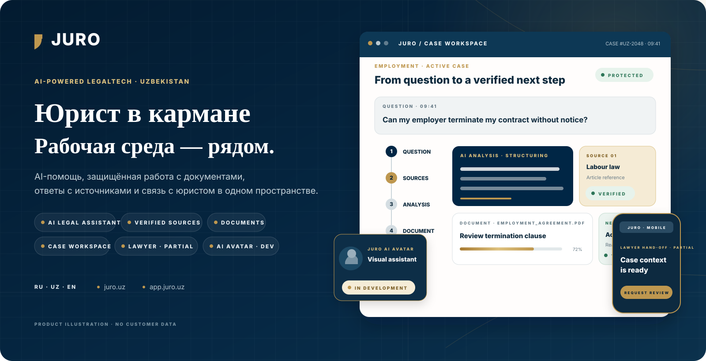

<picture>
  <source media="(max-width: 900px)" srcset="docs/github/showcase/hero-ru-mobile.svg">
  
</picture>

  <a href="README.md">English</a> · <strong>Русский</strong> · <a href="README.uz.md">O‘zbekcha</a>

  <a href="https://juro.uz"><strong>juro.uz</strong></a> ·
  <a href="https://app.juro.uz"><strong>Открыть платформу</strong></a> ·
  <a href="#product-demo">Демо продукта</a> ·
  <a href="#как-это-работает">Как это работает</a> ·
  <a href="#продуктовый-опыт">Продуктовый опыт</a> ·
  <a href="#архитектура">Архитектура</a> ·
  <a href="#быстрый-старт">Быстрый старт</a>

 

  <strong>Юридическая среда для реальных следующих шагов.</strong> 
  AI-помощь · ответы с источниками · защищённая работа с документами · дела · передача юристу

JURO — мультиязычная LegalTech-среда для Узбекистана, созданная на уровне современного международного продукта. Она соединяет юридические вопросы, источники, документы, дела и практические следующие шаги в одном защищённом пространстве — это не отдельный AI-чат.

> **Граница обещаний:** все композиции ниже — оригинальные продуктовые иллюстрации JURO без данных клиентов. Они объясняют реализованные и развиваемые workflow, но не выдаются за live-скриншоты или замену индивидуальной юридической консультации. AI Avatar явно обозначен как **IN DEVELOPMENT**.

## Демо продукта

<picture>
  <source media="(prefers-reduced-motion: reduce) and (max-width: 900px)" srcset="docs/github/showcase/product-demo-mobile-poster.svg">
  <source media="(prefers-reduced-motion: reduce)" srcset="docs/github/showcase/product-demo-poster.svg">
  <source media="(max-width: 900px)" srcset="docs/github/showcase/product-demo-mobile.gif">
  
</picture>

Цикл длительностью 12,6 секунды показывает связанный путь: **вопрос → анализ → источник → юридический контекст → следующий шаг → документ → юрист**. Все файлы находятся в репозитории; при предпочтении reduced motion отображается статичный poster.

## Что умеет JURO

<picture>
  <source media="(max-width: 900px)" srcset="docs/github/showcase/capability-board-mobile.svg">
  
</picture>

JURO объединяет несколько юридических рабочих поверхностей в одну систему. Доступность зависит от прав аккаунта и состояния deployment; evidence-led матрица ниже остаётся источником истины для статусов LIVE, WORKING, PARTIAL и IN DEVELOPMENT.

## Как это работает

<picture>
  <source media="(max-width: 900px)" srcset="docs/github/showcase/question-to-action-mobile.svg">
  
</picture>

Продукт построен вокруг движения к результату: собрать контекст, показать источник, сохранить работу в защищённой среде и превратить ответ в действие. Человеческая помощь остаётся отдельным осознанным шагом там, где текущий workflow и доступность это позволяют.

## AI, который показывает источники

<picture>
  <source media="(max-width: 900px)" srcset="docs/github/showcase/source-aware-ai-mobile.svg">
  
</picture>

Юридико-информационный путь JURO сохраняет видимой границу доказательности. Query-scoped retrieval, проверка допустимости цитат и сохранение direct citations реализованы в [direct-retrieval.ts](apps/platform/lib/legal/direct-retrieval.ts) и [direct-citation-store.ts](apps/platform/lib/legal/direct-citation-store.ts). Public-source path получает релевантные страницы Lex.uz и Advice.uz; JURO не заявляет официальный provider API, полноту покрытия законодательства или превращение AI-ответа в индивидуальную консультацию только благодаря source page.

## Интеллектуальная работа с документами

<picture>
  <source media="(max-width: 900px)" srcset="docs/github/showcase/document-intelligence-mobile.svg">
  
</picture>

В защищённой платформе существуют поверхности review, comparison, versioning и action plan. Иллюстрация показывает workflow, но не утверждает, что каждый путь прошёл свежую authenticated end-to-end проверку; там, где это указано в матрице, статус остаётся **PARTIAL**.

## AI Avatar — In Development

<picture>
  <source media="(max-width: 900px)" srcset="docs/github/showcase/ai-avatar-mobile.svg">
  
</picture>

JURO разрабатывает визуального AI-помощника для более естественного и доступного взаимодействия. Репозиторий **не** заявляет production-avatar, утверждённую rigged-модель, live lip-sync или завершённый voice path. Исследование, interface prototyping и утверждение asset остаются разработкой.

## Передача дела человеку

<picture>
  <source media="(max-width: 900px)" srcset="docs/github/showcase/lawyer-handoff-mobile.svg">
  
</picture>

Модель hand-off сохраняет вопрос, источники, документы и историю действий, чтобы пользователь мог запросить помощь человека без повторного объяснения дела с нуля. Это контролируемый продуктовый workflow, а не гарантия представительства, доступности юриста или результата.

## Построено для production

<picture>
  <source media="(max-width: 900px)" srcset="docs/github/showcase/technology-architecture-mobile.svg">
  
</picture>

Монорепозиторий разделяет публичную, защищённую и административную поверхности, сохраняя credentials и доступ к данным на серверной стороне. Frontend построен на React, Next.js и TypeScript; runtime и data layer используют Cloudflare Workers, Node.js, D1 и private R2; OpenAI настраивается только на сервере; CI/CD и artifact checks поддерживают дисциплину релиза.

## Продуктовый опыт

Ниже — поддерживаемые в репозитории captures реальных product surfaces без данных клиентов. Они дополняют объясняющие композиции выше.

| Публичный продукт | Защищённое рабочее пространство |
|---|---|
|  |  |
| **Публичный сайт** · мультиязычная точка входа | **Workspace** · дела, документы, действия и account-scoped navigation |

| AI-юридическая информация | Конструктор документов |
|---|---|
|  |  |
| **AI + источники** · структурированный ответ и evidence surfaces | **Документы** · библиотека, guided builder и generated-file paths |

| Review документов | Мобильная точка входа |
|---|---|
|  |  |
| **Review** · анализ и comparison (**PARTIAL**) | **Responsive experience** · narrow public-product preview |

## Архитектура и границы продукта

JURO — монорепозиторий с независимо развёртываемыми поверхностями:

- apps/website обеспечивает публичный сайт через React, Next.js, Vite/Vinext и Cloudflare Worker tooling.
- apps/platform содержит защищённые route handlers, AI evidence, documents, cases, authorization boundaries и generated-file flows.
- apps/admin — отдельная административная Worker-поверхность со статусом **PARTIAL**.
- Cloudflare D1 и private R2 хранят данные и файлы платформы; AI и email configuration остаются server-side.
- В платформе есть пути генерации DOCX, PDF и ZIP; email/OTP delivery при включении использует server-side provider configuration.

Сплошные связи означают implemented/working пути, пунктирные сохраняют границы PARTIAL или PLANNED. Инженерское обоснование и карту кода см. в [Product foundations](docs/github/PRODUCT_FOUNDATIONS.md).

## Доверие, приватность и юридическая безопасность

Репозиторий позволяет проверить server-side credentials, backend-mediated D1/R2 access, ownership/workspace checks, отображение источников и явные ограничения AI output. Здесь нет утверждений о GDPR, ISO, SOC 2, data residency или гарантированном юридическом результате.

Сообщайте об уязвимостях приватно по [SECURITY.md](SECURITY.md). Не публикуйте secrets, персональные данные, пользовательские документы или production logs в issue или pull request.

## Текущий статус

| Область | Статус | Примечание |
|---|---|---|
| Публичный сайт | LIVE | [juro.uz](https://juro.uz) вернул HTTP 200 10 сентября 2026 года. |
| Вход в защищённую платформу | LIVE | [app.juro.uz](https://app.juro.uz) вернул HTTP 200 и перенаправил на локализованный защищённый вход 10 сентября 2026 года. |
| AI-путь юридической информации | WORKING | Реализованы source-aware ответ и citation surfaces; расширенная legal evaluation — отдельный release gate. |
| Конструктор документов | WORKING | Реализованы persisted workflows, private storage и generated-file paths. |
| Анализ и сравнение документов | PARTIAL | Поверхности review и compare есть, но свежие аутентифицированные end-to-end доказательства не завершены. |
| Дела и планы действий | WORKING | Реализованы case, task и action-plan workflows. |
| Каталог юристов и консультации | PARTIAL | Controlled profiles, каталог и lifecycle hand-off ещё не завершены. |
| AI Avatar | IN DEVELOPMENT | Визуальный помощник остаётся направлением разработки; production-avatar, утверждённая rigged-модель и завершённый live voice path не заявляются. |
| Администрирование | PARTIAL | Есть отдельный admin Worker и защищённые административные flows. |
| Production-платежи | PLANNED | В репозитории не заявлен live payment provider. |

## Карта репозитория

    juro/
    ├── apps/
    │   ├── website/       # публичный сайт juro.uz
    │   ├── platform/      # app.juro.uz и юридические workflows
    │   └── admin/         # отдельный administrative Worker
    ├── docs/              # архитектура, миграции и operations
    ├── .github/           # CI, contribution и issue templates
    ├── .env.example       # только имена конфигурации, без secrets
    ├── SECURITY.md
    ├── package.json
    └── README.md

## Быстрый старт

### Требования

- Node.js 22.13 или новее.
- npm, совместимый с committed lockfiles.
- Bash и описанные POSIX-инструменты для legacy lifecycle `apps/website`; `apps/platform` использует shell-neutral Node launchers.
- Cloudflare-compatible bindings для persisted возможностей платформы.

Клонируйте и установите website и platform:

    git clone https://github.com/MoozUpus/juro.git
    cd juro
    npm run install:all

Запустите локально:

    npm run dev:website
    npm run dev:platform
    npm run dev:admin

Скопируйте `.env.example` в локальный ignored environment file. Никогда не коммитьте `.env`, API keys, access tokens, database exports, пользовательские документы или logs.

Переменные окружения и Cloudflare bindings

| Имя | Требуется | Scope | Назначение |
|---|---:|---|---|
| `OPENAI_API_KEY` | Только для live AI | Server | Аутентификация OpenAI Responses API |
| `OPENAI_MODEL` | Нет | Server | Необязательная замена модели |
| `RESEND_API_KEY` | Для email OTP | Server | Аутентификация email-провайдера |
| `EMAIL_FROM` | Для email OTP | Server | Верифицированный адрес отправителя |
| `JURO_SMOKE_BASE_URL` | Нет | Test process | Базовый URL smoke-теста document builder |
| `CLOUDFLARE_REMOTE_BINDINGS` | Нет | Local development | Включение remote bindings; нужен Wrangler login |
| `DB` | Persisted features | Worker binding | Cloudflare D1 |
| `BUCKET` | File workflows | Worker binding | Private Cloudflare R2 |
| `ASSETS` / `IMAGES` | Hosting managed | Worker binding | Статические assets и image optimization |

`DB`, `BUCKET`, `ASSETS` и `IMAGES` — platform bindings, а не secrets для environment file. Ключи AI и email — только server-side configuration, их нельзя раскрывать через public browser variables.

## Качество и тестирование

Из корня репозитория:

    npm run lint
    npm run type-check
    npm test
    npm run build
    npm run validate:artifact

CI определён в [.github/workflows/ci.yml](.github/workflows/ci.yml). Он включает locked installs, linting, TypeScript checks, tests, artifact validation и platform Cloudflare environment matrix. Для matrix и dry-run только платформы:

    npm --prefix apps/platform run validate:cloudflare:matrix

## Развёртывание

Website и platform развёртываются независимо. Для platform нужны D1 migrations, private R2 bindings, server-side secrets и явные permission checks; перед production approval оба target должны быть проверены в preview.

Последовательность релиза, ожидания rollback, DNS safeguards и backup requirements описаны в [docs/DEPLOYMENT.md](docs/DEPLOYMENT.md). [docs/MIGRATION.md](docs/MIGRATION.md) сохраняет аудит source migration и alternative hosting.

## Roadmap

| Сейчас | Далее | Позже |
|---|---|---|
| Поддерживать source-aware информацию, document workflows, permissions и release evidence. | Завершить аутентифицированную проверку document analysis и lawyer hand-off. | Рассматривать платежи и расширение экосистемы только после подтверждения product, security и operational gates. |

## Участие и лицензия

JURO — product-managed repository. Приветствуются сфокусированные и безопасные contributions; см. [.github/CONTRIBUTING.md](.github/CONTRIBUTING.md) и используйте подготовленные issue и pull-request templates. Pull request не разрешает production deployment, DNS change или доступ к production data.

В репозитории пока нет файла лицензии. Права на повторное использование не предоставлены; свяжитесь с владельцем репозитория до использования кода или presentation assets.

---

Происхождение и правила обновления presentation assets: [docs/github/README_ASSETS.md](docs/github/README_ASSETS.md).
