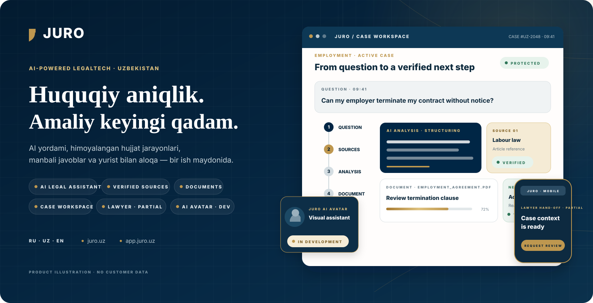

<picture>
  <source media="(max-width: 900px)" srcset="docs/github/showcase/hero-uz-mobile.svg">
  
</picture>

  <a href="README.md">English</a> · <a href="README.ru.md">Русский</a> · <strong>O‘zbekcha</strong>

  <a href="https://juro.uz"><strong>juro.uz</strong></a> ·
  <a href="https://app.juro.uz"><strong>Platformani ochish</strong></a> ·
  <a href="#product-demo">Mahsulot demo</a> ·
  <a href="#qanday-ishlaydi">Qanday ishlaydi</a> ·
  <a href="#mahsulot-tajribasi">Mahsulot tajribasi</a> ·
  <a href="#arxitektura">Arxitektura</a> ·
  <a href="#tezkor-boshlash">Tezkor boshlash</a>

 

  <strong>Aniq keyingi qadamlar uchun huquqiy intellekt.</strong> 
  AI huquqiy yordam · manbali javoblar · himoyalangan hujjat jarayonlari · ishlar · yuristga yo‘naltirish

JURO — O‘zbekiston uchun yaratilgan, xalqaro mahsulot va muhandislik standartlariga yo‘naltirilgan ko‘p tilli LegalTech ish maydoni. U huquqiy savollar, manbalar, hujjatlar, ishlar va amaliy keyingi qadamlarni bitta himoyalangan muhitda bog‘laydi — bu alohida AI-chat emas.

> **Mahsulot chegarasi:** quyidagi kompozitsiyalar mijoz ma’lumotlarisiz yaratilgan original JURO mahsulot illyustratsiyalaridir. Ular amalga oshirilgan va rivojlantirilayotgan workflow’larni tushuntiradi, ammo live screenshot yoki individual yuridik maslahat o‘rnida ko‘rsatilmaydi. AI Avatar aniq **IN DEVELOPMENT** deb belgilangan.

## Mahsulot demo

<picture>
  <source media="(prefers-reduced-motion: reduce) and (max-width: 900px)" srcset="docs/github/showcase/product-demo-mobile-poster.svg">
  <source media="(prefers-reduced-motion: reduce)" srcset="docs/github/showcase/product-demo-poster.svg">
  <source media="(max-width: 900px)" srcset="docs/github/showcase/product-demo-mobile.gif">
  
</picture>

12,6 soniyalik sikl bog‘langan yo‘lni ko‘rsatadi: **savol → tahlil → manba → huquqiy kontekst → keyingi qadam → hujjat → yurist**. Barcha assetlar repozitoriy ichida; reduced motion tanlanganida statik poster ko‘rsatiladi.

## JURO nimalarni qila oladi

<picture>
  <source media="(max-width: 900px)" srcset="docs/github/showcase/capability-board-mobile.svg">
  
</picture>

JURO bir nechta huquqiy ish sirtlarini bitta tizimga birlashtiradi. Mavjudlik account permission va deployment holatiga bog‘liq; quyidagi evidence-led matritsa LIVE, WORKING, PARTIAL va IN DEVELOPMENT holatlari uchun asosiy manba bo‘lib qoladi.

## Qanday ishlaydi

<picture>
  <source media="(max-width: 900px)" srcset="docs/github/showcase/question-to-action-mobile.svg">
  
</picture>

Mahsulot chat soniga emas, natijaga tomon harakatga qurilgan: to‘g‘ri kontekstni yig‘ish, manbani ko‘rsatish, ishni himoyalangan muhitda saqlash va javobni amaliy harakatga aylantirish. Inson yordami joriy workflow va mavjudlik ruxsat bergan joyda alohida qadam bo‘lib qoladi.

## Manbalarini ko‘rsatadigan AI

<picture>
  <source media="(max-width: 900px)" srcset="docs/github/showcase/source-aware-ai-mobile.svg">
  
</picture>

JURO huquqiy axborot yo‘li dalil chegarasini ko‘rinadigan saqlaydi. Query-scoped retrieval, citation eligibility va direct citation saqlash [direct-retrieval.ts](apps/platform/lib/legal/direct-retrieval.ts) hamda [direct-citation-store.ts](apps/platform/lib/legal/direct-citation-store.ts) da amalga oshirilgan. Public-source path tegishli Lex.uz va Advice.uz sahifalarini oladi; JURO rasmiy provider API, qonunchilikning to‘liq qamrovi yoki source page mavjudligi AI javobini individual yuridik maslahatga aylantirishini da’vo qilmaydi.

## Hujjat intellekti

<picture>
  <source media="(max-width: 900px)" srcset="docs/github/showcase/document-intelligence-mobile.svg">
  
</picture>

Himoyalangan platformada review, comparison, versioning va action-plan sirtlari mavjud. Illyustratsiya workflow’ni tushuntiradi, ammo har bir tahlil yo‘li yangi authenticated end-to-end tekshiruvdan o‘tganini da’vo qilmaydi; matritsada ko‘rsatilgan joylarda holat **PARTIAL** bo‘lib qoladi.

## AI Avatar — In Development

<picture>
  <source media="(max-width: 900px)" srcset="docs/github/showcase/ai-avatar-mobile.svg">
  
</picture>

JURO tabiiyroq va hammabop muloqot uchun vizual AI huquqiy yordamchini ishlab chiqmoqda. Repozitoriy production avatar, tasdiqlangan rigged character, live lip-sync yoki tugallangan voice path mavjudligini **da’vo qilmaydi**. Research, interface prototyping va asset approval ishlab chiqish bosqichida.

## Yuristga yo‘naltirish

<picture>
  <source media="(max-width: 900px)" srcset="docs/github/showcase/lawyer-handoff-mobile.svg">
  
</picture>

Hand-off modeli savol, manbalar, hujjatlar va harakat tarixini saqlaydi, shunda foydalanuvchi ishni boshidan tushuntirmasdan inson yordamini so‘rashi mumkin. Bu boshqariladigan mahsulot workflow’i; vakillik, yurist mavjudligi yoki natija kafolati emas.

## Production uchun qurilgan

<picture>
  <source media="(max-width: 900px)" srcset="docs/github/showcase/technology-architecture-mobile.svg">
  
</picture>

Monorepozitoriy public, protected va administrative sirtlarni ajratadi; credentials va data access server chegarasida qoladi. Frontend React, Next.js va TypeScript’da; runtime hamda data layer Cloudflare Workers, Node.js, D1 va private R2’da; OpenAI faqat server-side sozlanadi; CI/CD va artifact checks release intizomini qo‘llab-quvvatlaydi.

## Mahsulot tajribasi

Quyida mijoz ma’lumotlarisiz, repozitoriyda saqlanadigan haqiqiy product surface capture’lari keltirilgan. Ular yuqoridagi tushuntiruvchi kompozitsiyalarni to‘ldiradi.

| Ommaviy mahsulot | Himoyalangan ish maydoni |
|---|---|
|  |  |
| **Ommaviy sayt** · ko‘p tilli kirish nuqtasi | **Workspace** · ishlar, hujjatlar, harakatlar va account-scoped navigation |

| AI huquqiy axborot | Hujjat konstruktori |
|---|---|
|  |  |
| **AI + manbalar** · tuzilgan javob va evidence surfaces | **Hujjatlar** · kutubxona, guided builder va generated-file paths |

| Hujjat review | Mobil mahsulot kirishi |
|---|---|
|  |  |
| **Review** · analysis va comparison (**PARTIAL**) | **Responsive experience** · narrow public-product preview |

## Arxitektura va mahsulot chegaralari

JURO mustaqil deploy qilinadigan sirtlarga ega monorepozitoriydir:

- apps/website React, Next.js, Vite/Vinext va Cloudflare Worker tooling orqali ommaviy saytni ta’minlaydi.
- apps/platform himoyalangan route handler’lar, AI evidence, hujjatlar, ishlar, authorization boundary va generated-file flow’larni beradi.
- apps/admin — **PARTIAL** holatidagi alohida Worker-based administrative surface.
- Cloudflare D1 va private R2 platforma ma’lumotlari hamda fayllarini saqlaydi; AI va email configuration server-side bo‘lib qoladi.
- Platformada DOCX, PDF va ZIP generation path’lari mavjud; email/OTP delivery yoqilganda server-side provider configuration ishlatiladi.

Solid connection’lar implemented/working yo‘llarni, dashed connection’lar PARTIAL yoki PLANNED chegaralarni bildiradi. Muhandislik asoslari va kod xaritasini [Product foundations](docs/github/PRODUCT_FOUNDATIONS.md) hujjatida o‘qing.

## Ishonch, maxfiylik va yuridik xavfsizlik

Repozitoriy server-side credentials, backend-mediated D1/R2 access, ownership/workspace checks, manba ko‘rsatish va AI output cheklovlarini tekshiriladigan qiladi. Bu yerda GDPR, ISO, SOC 2, data residency yoki yuridik natija da’vosi berilmaydi.

Zaiflik haqida [SECURITY.md](SECURITY.md) orqali maxfiy xabar bering. Issue yoki pull request ichiga secret, shaxsiy ma’lumot, foydalanuvchi hujjati yoki production log joylamang.

## Joriy holat

| Soha | Holat | Izoh |
|---|---|---|
| Ommaviy veb-sayt | LIVE | [juro.uz](https://juro.uz) 2026-09-10 kuni HTTP 200 qaytardi. |
| Himoyalangan platformaga kirish | LIVE | [app.juro.uz](https://app.juro.uz) 2026-09-10 kuni HTTP 200 qaytardi va mahalliylashtirilgan himoyalangan kirish sahifasiga yo‘naltirdi. |
| AI huquqiy ma’lumot oqimi | WORKING | Source-aware javob va citation surfaces amalga oshirilgan; kengroq legal evaluation alohida release gate hisoblanadi. |
| Hujjat konstruktori | WORKING | Persisted document workflows, private storage va generated-file paths amalga oshirilgan. |
| Hujjat tahlili va taqqoslash | PARTIAL | Review va comparison yuzalari bor, ammo yangi authenticated end-to-end evidence yakunlanmagan. |
| Ishlar va harakat rejalari | WORKING | Case, task va action-plan workflows amalga oshirilgan. |
| Yuristlar katalogi va konsultatsiyalar | PARTIAL | Controlled profiles, katalog va hand-off lifecycle hali to‘liq emas. |
| AI Avatar | IN DEVELOPMENT | Vizual yordamchi ishlab chiqish yo‘nalishida; production avatar, tasdiqlangan rigged character yoki yakunlangan live voice path da’vo qilinmaydi. |
| Ma’muriyat | PARTIAL | Alohida admin Worker va himoyalangan administrative flows mavjud. |
| Production to‘lovlar | PLANNED | Repozitoriyda live payment provider da’vo qilinmaydi. |

## Repozitoriy xaritasi

    juro/
    ├── apps/
    │   ├── website/       # juro.uz ommaviy sayti
    │   ├── platform/      # app.juro.uz va yuridik workflows
    │   └── admin/         # alohida administrative Worker
    ├── docs/              # arxitektura, migrations va operations
    ├── .github/           # CI, contribution va issue templates
    ├── .env.example       # faqat konfiguratsiya nomlari, secrets yo‘q
    ├── SECURITY.md
    ├── package.json
    └── README.md

## Tezkor boshlash

### Talablar

- Node.js 22.13 yoki yangiroq.
- Committed lockfiles bilan mos npm.
- Legacy `apps/website` lifecycle uchun Bash va hujjatlashtirilgan POSIX tools; `apps/platform` shell-neutral Node launchersdan foydalanadi.
- Persisted platform imkoniyatlari uchun Cloudflare-compatible bindings.

Website va platformani klonlab o‘rnating:

    git clone https://github.com/MoozUpus/juro.git
    cd juro
    npm run install:all

Lokal ishga tushiring:

    npm run dev:website
    npm run dev:platform
    npm run dev:admin

`.env.example` faylini local ignored environment filega nusxalang. `.env`, API keys, access tokens, database exports, foydalanuvchi hujjatlari yoki logsni hech qachon commit qilmang.

Muhit o‘zgaruvchilari va Cloudflare bindings

| Nomi | Kerak | Scope | Vazifasi |
|---|---:|---|---|
| `OPENAI_API_KEY` | Faqat live AI uchun | Server | OpenAI Responses API autentifikatsiyasi |
| `OPENAI_MODEL` | Yo‘q | Server | Ixtiyoriy model o‘rnini bosish |
| `RESEND_API_KEY` | Email OTP uchun | Server | Email provayderi autentifikatsiyasi |
| `EMAIL_FROM` | Email OTP uchun | Server | Tasdiqlangan jo‘natuvchi manzili |
| `JURO_SMOKE_BASE_URL` | Yo‘q | Test process | Document builder smoke-test base URL |
| `CLOUDFLARE_REMOTE_BINDINGS` | Yo‘q | Local development | Remote bindings’ni yoqish; Wrangler login kerak |
| `DB` | Persisted features | Worker binding | Cloudflare D1 |
| `BUCKET` | File workflows | Worker binding | Private Cloudflare R2 |
| `ASSETS` / `IMAGES` | Hosting managed | Worker binding | Static assets va image optimization |

`DB`, `BUCKET`, `ASSETS` va `IMAGES` platform bindings bo‘lib, environment filega yoziladigan secrets emas. AI va email keys faqat server-side configuration bo‘lishi, public browser variables orqali oshkor qilinmasligi kerak.

## Sifat va testlash

Repozitoriy ildizidan:

    npm run lint
    npm run type-check
    npm test
    npm run build
    npm run validate:artifact

CI [.github/workflows/ci.yml](.github/workflows/ci.yml) da belgilangan. U locked installs, linting, TypeScript checks, tests, artifact validation hamda platform Cloudflare environment matrixni qamrab oladi. Faqat platform matrix va dry-run uchun:

    npm --prefix apps/platform run validate:cloudflare:matrix

## Deploy

Website va platform deploylari ataylab mustaqil. Platformaga D1 migrations, private R2 bindings, server-side secrets va aniq permission checks kerak; production approvaldan oldin ikkala target previewda tekshirilishi lozim.

Release sequence, rollback expectations, DNS safeguards va backup requirements uchun [docs/DEPLOYMENT.md](docs/DEPLOYMENT.md) ni o‘qing. [docs/MIGRATION.md](docs/MIGRATION.md) source-migration hamda alternative-hosting auditni saqlaydi.

## Roadmap

| Hozir | Keyin | Keyinroq |
|---|---|---|
| Source-aware ma’lumot, document workflows, permissions va release evidence’ni saqlash. | Document analysis va lawyer hand-off’ni authenticated tekshirishni yakunlash. | Payments hamda kengroq ekotizim integratsiyalarini faqat product, security va operational gates tasdiqlangandan keyin ko‘rib chiqish. |

## Hissa va litsenziya

JURO — product-managed repository. Tor doiradagi, xavfsiz contributions qabul qilinadi; [.github/CONTRIBUTING.md](.github/CONTRIBUTING.md) ni o‘qing va tayyor issue hamda pull-request templatesdan foydalaning. Pull request production deployment, DNS change yoki production data’ga kirishga ruxsat bermaydi.

Hozircha license file mavjud emas. Qayta foydalanish huquqi berilmagan; code yoki presentation assetsdan foydalanishdan oldin repozitoriy egasi bilan bog‘laning.

---

Presentation assets kelib chiqishi va yangilash qoidalari: [docs/github/README_ASSETS.md](docs/github/README_ASSETS.md).
