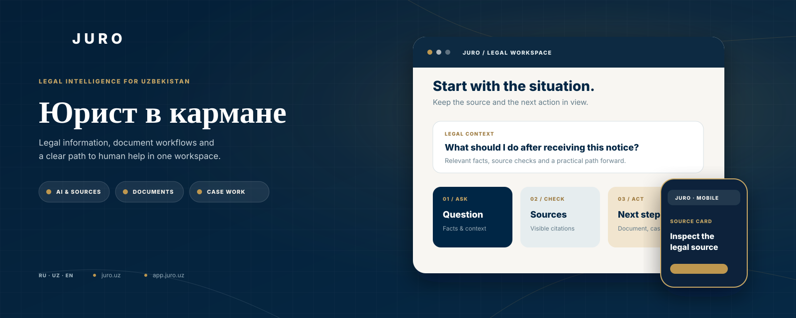
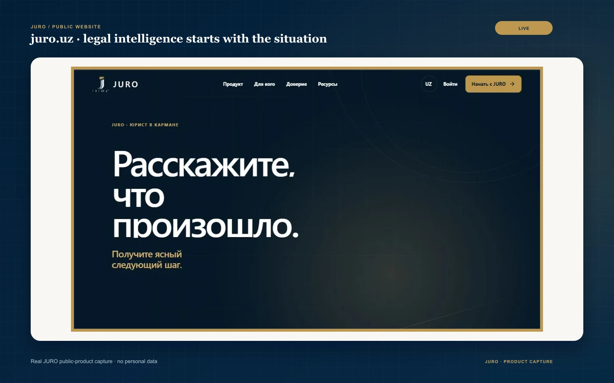
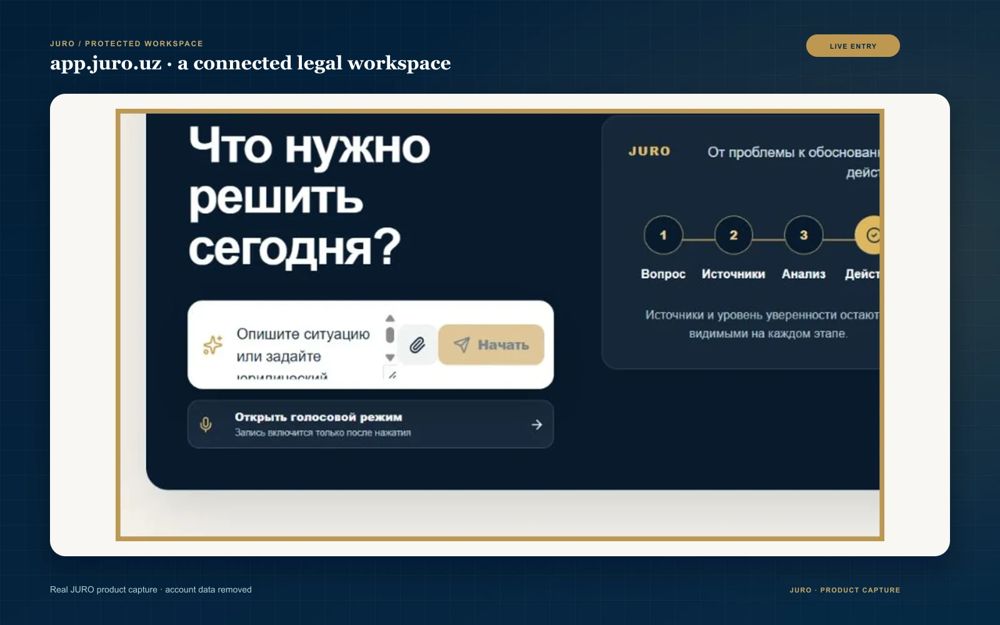
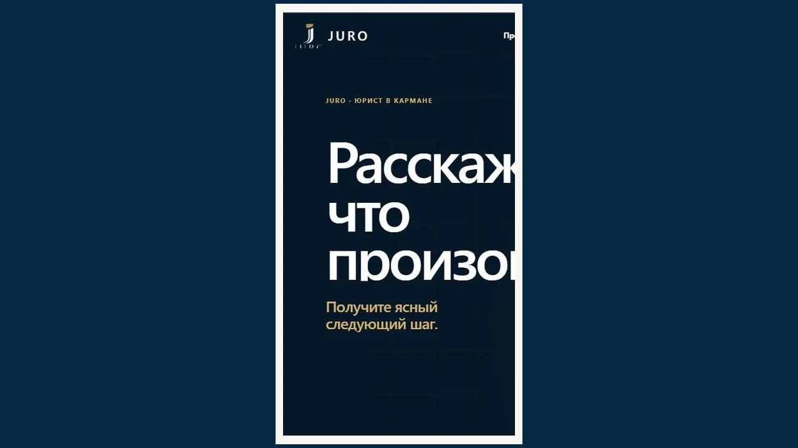
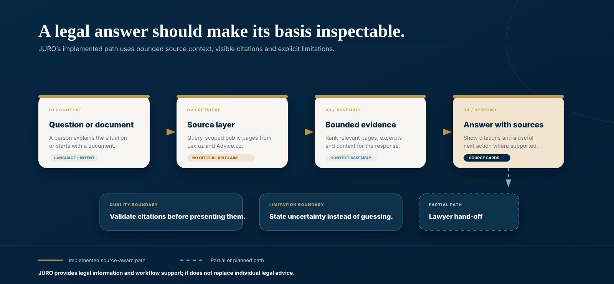
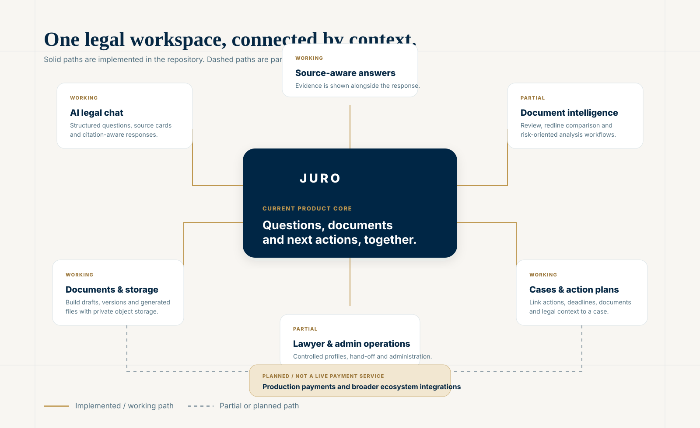
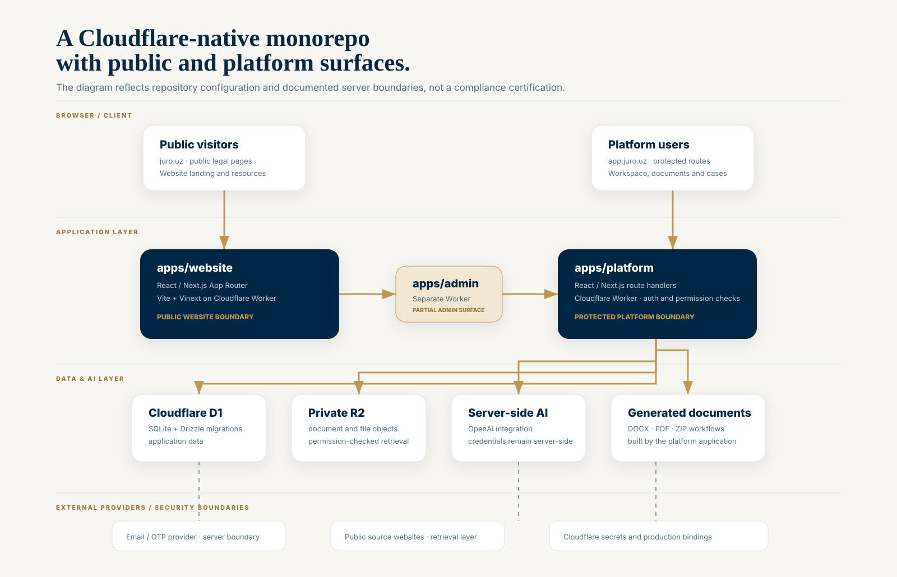
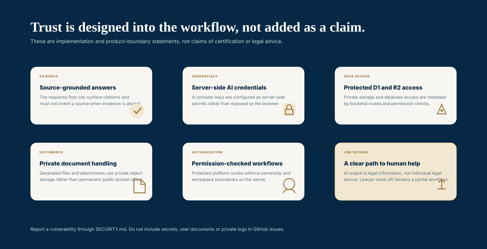

  

  <a href="README.md">English</a> · <a href="README.ru.md">Русский</a> · <a href="README.uz.md">O‘zbekcha</a>

  <a href="https://juro.uz">Jonli sayt</a> ·
  <a href="https://app.juro.uz">Platformani ochish</a> ·
  <a href="#mahsulot-sayohati">Mahsulot sayohati</a> ·
  <a href="#arxitektura">Arxitektura</a> ·
  <a href="#tezkor-boshlash">Tezkor boshlash</a>

 

  

JURO — O‘zbekiston uchun LegalTech ish maydoni bo‘lib, yuridik savollarni, hujjatlar bilan ishlashni va keyingi harakatlarni yagona kontekstga bog‘laydi. U amaliy huquqiy ma’lumot, tartibli hujjat jarayonlari va zarur holatda tirik yurist yordamiga yo‘l kerak bo‘lgan insonlar hamda jamoalar uchun yaratilgan.

Ommaviy sayt [juro.uz](https://juro.uz) manzilida, himoyalangan mahsulot platformasi esa [app.juro.uz](https://app.juro.uz) manzilida mavjud. Ushbu repozitoriyda ikkala ilovaning manba kodi, Cloudflare konfiguratsiyasi, hujjatlar va sifat tekshiruvlari joylashgan.

## JURO nima?

Huquqiy ma’lumotni topish va tushunish qiyin, an’anaviy yuridik xizmatlar esa qimmat yoki tarqoq bo‘lishi mumkin. JURO bu murakkablikni kamaytirishga mo‘ljallangan: savol yoki hujjatdan boshlash, manba va kontekstni ko‘rinadigan holda saqlash, so‘ng mahsulot qo‘llagan joyda loyiha, reja yoki mutaxassisga topshirishga o‘tish.

Mahsulot O‘zbekistonga yo‘naltirilgan. Joriy ommaviy interfeys rus va o‘zbek tillarini taklif qiladi; repozitoriy hujjatlari xalqaro texnik auditoriya uchun ingliz tilida ham yuritiladi. JURO AI natijasini individual yuridik maslahat yoki yurist o‘rnini bosuvchi vosita sifatida ko‘rsatmaydi.

## Mahsulot sayohati

| Ommaviy yuridik-intellekt kirish nuqtasi | Himoyalangan ish maydoni |
|---|---|
|  |  |
| Jonli ommaviy saytda vaziyat, hujjat yoki keyingi qadamdan boshlang. | Himoyalangan maydonda savol, manba, hujjat va harakatni bog‘lang. |

| AI-chat boshlang‘ich holati | Hujjat konstruktori |
|---|---|
|  |  |
| Interfeys yuridik vaziyatni bayon qilishni so‘raydi va manba mavjudligini ochiq ko‘rsatadi. | Hujjat jarayonlarini ko‘ring va tartibli loyiha tayyorlashni boshlang. |

| Hujjat tekshiruvi va taqqoslash | Tor ommaviy preview |
|---|---|
|  |  |
| Tekshiruv va taqqoslash UI mavjud; quyida uning to‘liq jarayon holati PARTIAL deb ko‘rsatilgan. | Jonli ommaviy saytning tor presentation-cropi; mobile QA dalili sifatida ishlatishdan oldin tasdiqlangan mobile-capture bilan almashtiring. |

## Foydalanuvchilar nimalar qila oladi

| Imkoniyat | Foydalanuvchi qiymati | Holat |
|---|---|---|
| Yuridik savol berish | Ko‘rinadigan manbalar bilan tartibli huquqiy ma’lumot jarayonini boshlash. | WORKING |
| Hujjat yaratish | Loyiha tayyorlash va qo‘llab-quvvatlangan fayllarni generatsiya qilish. | WORKING |
| Hujjatni tekshirish yoki solishtirish | Hujjatni ko‘rib chiqish va versiyalarni taqqoslash; yangi to‘liq tahlil dalillari hali yakunlanmagan. | PARTIAL |
| Harakat rejasini tuzish | Harakatlar, muddatlar, hujjatlar va huquqiy kontekstni ishga bog‘lash. | WORKING |
| Yurist yordamini so‘rash | Mavjud joyda boshqariladigan profil va hand-off oqimidan foydalanish. | PARTIAL |
| Production to‘lov xizmatidan foydalanish | Repozitoriyda ishlayotgan to‘lov xizmati haqidagi da’vo yo‘q. | PLANNED |

## JURO qanday ishlaydi

JUROning amalga oshirilgan source-aware yo‘li so‘rovni tasniflaydi, tegishli ommaviy huquqiy sahifalarni topadi, cheklangan kontekstni yig‘adi va dalil mavjud bo‘lganda manba kartalari bilan tartibli javobni ko‘rsatadi. Manba qatlami Lex.uz va Advice.uz sahifalaridan query-scoped to‘g‘ridan-to‘g‘ri olishdir; u rasmiy provider API da’vosi emas.

- Manba foydalanuvchiga ko‘rinishi kerak; tizim havolani o‘ylab topmasligi kerak.
- Mavjud dalil xulosani qo‘llab-quvvatlamasa, mahsulot cheklovni aytishi kerak.
- AI natijasi huquqiy ma’lumot va ish jarayoni yordami, individual yuridik maslahat emas.
- Yuristga topshirish qisman mahsulot oqimi; u vakillik yoki yakunlangan maslahat kafolati emas.

## Mahsulot ekotizimi

Sxema hozirgi mahsulot yadrosini qisman oqimlar va rejalashtirilgan to‘lovlardan ajratadi. Uzluksiz chiziqlar repozitoriydagi amalga oshirilgan yoki ishlayotgan yuzalarni, punktir chiziqlar esa PARTIAL yoki PLANNED ishlarni bildiradi.

## Arxitektura

JURO — mustaqil deploy qilinadigan ommaviy va himoyalangan ilovalarga ega monorepozitoriy:

- apps/website React, Next.js, Vite/Vinext va Cloudflare Worker tooling orqali ommaviy saytni ta’minlaydi.
- apps/platform himoyalangan route handlerlar, hujjat oqimlari, authorization chegaralari va generated-file flowsni o‘z ichiga oladi.
- apps/admin — PARTIAL holatdagi alohida Worker-based ma’muriy sirt.
- Cloudflare D1 va private R2 saqlanadigan platforma ma’lumotlari hamda fayllarini qo‘llab-quvvatlaydi; OpenAI integratsiyasi server-side ishlaydi.
- Platforma DOCX, PDF va ZIP generatsiyasini qo‘llaydi. Yoqilganda email/OTP server-side provider settings orqali sozlanadi.

## Ishonch, maxfiylik va yuridik xavfsizlik

Repozitoriy chegaralari ataylab belgilangan: credentials serverda qoladi, D1/R2 ga kirish backend routes orqali, himoyalangan oqimlar ownership yoki workspace tekshiruvini bajaradi. Bu yerda GDPR, ISO, SOC 2 yoki boshqa sertifikatlar da’vo qilinmaydi. Mas’uliyatli zaiflik xabari uchun [SECURITY.md](SECURITY.md) fayliga qarang.

## Joriy holat

| Yo‘nalish | Holat | Izoh |
|---|---|---|
| Ommaviy veb-sayt | LIVE | [juro.uz](https://juro.uz) hujjatlar auditi paytida ochildi. |
| Himoyalangan platformaga kirish | LIVE | [app.juro.uz](https://app.juro.uz) ochiladi va himoyalangan mahsulot yo‘llarini xizmat qiladi. |
| AI legal chat | WORKING | Source-aware response va citation surfaces amalga oshirilgan; kengroq legal evaluation alohida release gate. |
| Hujjat konstruktori | WORKING | Persisted workflows, private storage va generated-file paths amalga oshirilgan. |
| Hujjat tahlili va taqqoslash | PARTIAL | Review/compare yuzalari bor, ammo yangi authenticated end-to-end analysis evidence yakunlanmagan. |
| Ishlar va harakat rejalari | WORKING | Cases, tasks va action-plan workflows amalga oshirilgan. |
| Yuristlar marketpleysi va konsultatsiyalar | PARTIAL | Controlled profiles, directory va hand-off lifecycle hali to‘liq emas. |
| Ma’muriyat | PARTIAL | Alohida admin Worker va himoyalangan administrative flows mavjud. |
| Production to‘lovlar | PLANNED | Demo/payment-foundation code ishlayotgan to‘lov xizmati sifatida ko‘rsatilmaydi. |

## Repozitoriy tuzilishi

    juro/
    ├── apps/
    │   ├── website/       # juro.uz ommaviy sayti
    │   ├── platform/      # app.juro.uz va yuridik workflows
    │   └── admin/         # alohida administrative Worker
    ├── docs/
    ├── .github/
    ├── .env.example
    ├── SECURITY.md
    ├── package.json
    └── README.md

## Tezkor boshlash

### Talablar

- Node.js 22.13 yoki yangiroq.
- Committed lockfiles bilan mos npm.
- Legacy apps/website lifecycle uchun Bash va hujjatlashtirilgan POSIX tools; apps/platform shell-neutral Node launchersdan foydalanadi.
- Persisted platform features uchun Cloudflare-compatible bindings.

Klonlash va o‘rnatish:

    git clone https://github.com/MoozUpus/juro.git
    cd juro
    npm run install:all

Lokal ishga tushirish:

    npm run dev:website
    npm run dev:platform
    npm run dev:admin

.env.example faylini lokal ignored environment filega nusxalang. .env, API keys, access tokens, database exports, user documents yoki loglarni hech qachon commit qilmang.

Muhit o‘zgaruvchilari va Cloudflare bindings

| Nomi | Talab qilinadi | Scope | Vazifasi |
|---|---:|---|---|
| OPENAI_API_KEY | Faqat live AI uchun | Server | OpenAI Responses API authentication |
| OPENAI_MODEL | Yo‘q | Server | Optional model override |
| RESEND_API_KEY | Email OTP uchun | Server | Email-provider authentication |
| EMAIL_FROM | Email OTP uchun | Server | Verified sender address |
| JURO_SMOKE_BASE_URL | Yo‘q | Test process | Document-builder smoke-test base URL |
| CLOUDFLARE_REMOTE_BINDINGS | Yo‘q | Local development | Remote bindingsga opt in; Wrangler login kerak |
| DB | Persisted features | Worker binding | Cloudflare D1 |
| BUCKET | File workflows | Worker binding | Private Cloudflare R2 |
| ASSETS / IMAGES | Hosting managed | Worker binding | Static assets va image optimization |

DB, BUCKET, ASSETS va IMAGES platform bindings bo‘lib, environment filega yoziladigan secrets emas. AI va email keys faqat server-side configurationdir, ular public browser variables bo‘lmasligi kerak.

## Sifat va testlar

Repozitoriy ildizidan:

    npm run lint
    npm run type-check
    npm test
    npm run build
    npm run validate:artifact

CI [.github/workflows/ci.yml](.github/workflows/ci.yml) faylida belgilangan va locked installs, linting, TypeScript checks, tests, artifact validation hamda platform Cloudflare environment matrixni ishga tushiradi. Platform matrix va dry-run uchun:

    npm --prefix apps/platform run validate:cloudflare:matrix

## Deploy

Website va platform deploylari ataylab mustaqil. Platform uchun D1 migrations, private R2 bindings, server-side secrets va aniq permission checks kerak; ikkala target production approvaldan oldin previewda sinovdan o‘tishi lozim.

Release sequence, rollback expectations, DNS safeguards va backup requirements uchun [docs/DEPLOYMENT.md](docs/DEPLOYMENT.md) fayliga qarang. [docs/MIGRATION.md](docs/MIGRATION.md) source-migration hamda alternative-hosting auditni saqlaydi.

## Roadmap

| Now | Next | Later |
|---|---|---|
| Source-aware javoblar, document workflows, permissions va release evidence ni saqlash. | Document analysis va lawyer hand-off bo‘yicha authenticated verificationni yakunlash. | Production payments va wider integrationsni faqat product, security va operational gates tasdiqlangandan keyin ko‘rib chiqish. |

## Xavfsizlik

Zaifliklarni [SECURITY.md](SECURITY.md) da ko‘rsatilganidek yopiq tarzda bildiring. Issues yoki pull requestlarga secrets, personal data, user documents yoki production logsni qo‘shmang. Credential oshkor bo‘lsa, uni almashtirish kerak; keyingi revisiondan o‘chirishning o‘zi yetarli emas.

## Hissa qo‘shish

JURO — product-managed repository. Tor doiradagi va xavfsiz contributions qabul qilinadi; [.github/CONTRIBUTING.md](.github/CONTRIBUTING.md) fayliga qarang va issue/PR templatesdan foydalaning. Pull Request production deploy, DNS change yoki production data ga kirishga ruxsat bermaydi.

## Litsenziya

Hozir repozitoriyda license file yo‘q. Bu yerda qayta foydalanish huquqi berilmagan; code yoki assetsdan foydalanishdan oldin repo egasi bilan bog‘laning.

---

Presentation assets kelib chiqishi va yangilash qoidalari: [docs/github/README_ASSETS.md](docs/github/README_ASSETS.md).
