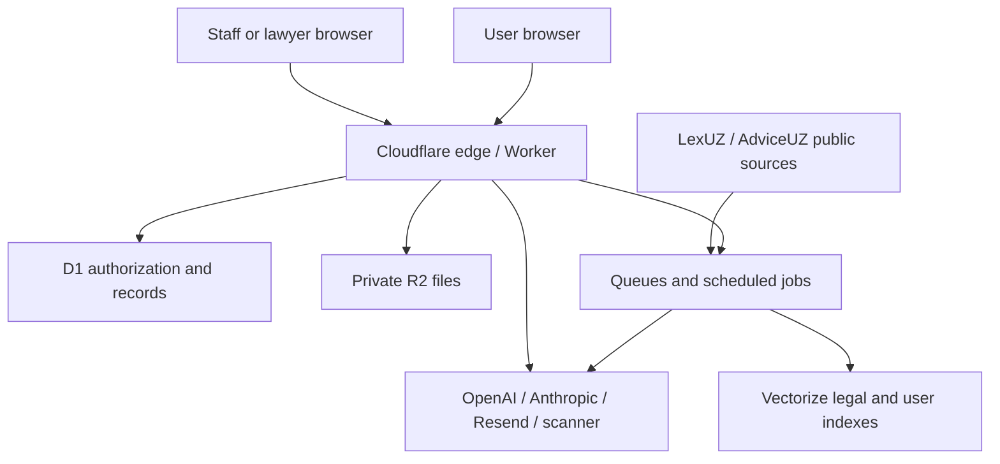

# JURO threat model

Initial version: 2026-07-26  
Scope: platform identity, workspaces, AI, legal knowledge, documents, lawyers, staff access, and Cloudflare infrastructure.

This is the Phase 0 threat baseline, updated after the 2026-07-28 read-only production inventory and scoped non-production resource provisioning. It will be updated with each vertical slice and staging evidence.

## Protected assets

- account identity, OTP/session/TOTP credentials, recovery codes;
- personal and third-party PII;
- chats, cases, documents, OCR text, analyses, signatures, and exports;
- workspace membership and document collaboration rights;
- legal-source provenance, versions, verification state, and editor decisions;
- AI system instructions, provider credentials, model configuration, and cost limits;
- staff privileges, support access, lawyer grants, and conflict checks;
- append-only consent/access/security/cost evidence;
- D1, R2, Queue, Vectorize, backup, and deployment controls.

## Trust boundaries

The diagram below is the target trust architecture. Production D1/private R2 are deployed; isolated development/staging Queue/DLQ and Vectorize resources are provisioned but unbound and empty. Consumers, ingestion, legal-source synchronization, and AI/scanner provider paths are not deployed as this architecture.

Every boundary assumes incoming identifiers and document text are untrusted. Vector metadata filters and provider output are not authorization decisions.

## Primary threat actors

- unauthenticated abuse and credential/OTP enumeration;
- authenticated user attempting cross-account or cross-workspace access;
- invited collaborator before acceptance or after revoke;
- malicious uploaded document/archive or prompt-injection payload;
- compromised account, lawyer, support, or administrator;
- malicious or compromised upstream/source page;
- provider outage, malformed output, or unexpected logging;
- accidental operator deployment, migration, or secret exposure;
- automated cost exhaustion and queue replay.

## Threat register

| ID | Threat | Current exposure | Required controls |
|---|---|---|---|
| T-01 | OTP enumeration/brute force | local atomic claims and disabled keyed evidence exist; independent limits, Turnstile, remote activation, and legacy-digest drain are absent | generic response, Turnstile, per-email/IP limits, staged HMAC activation, atomic attempts/lock |
| T-02 | session fixation/replay | local device/session revocation foundation exists; rotation, remote evidence, regional signals, and security mail remain absent | rotation, staged device/session tests, security-event revoke, one/all logout, alerts |
| T-03 | IDOR/cross-tenant access | deployed Sites v20 retains the confirmed builder listing/invitation gaps; the integration branch locally fixes pre-accept denial and active-workspace builder isolation with negative/concurrency tests, but is not staged | central object authorization across every domain, remote D1/full HTTP negative matrix, neutral response, staging proof |
| T-04 | invitation/token replay | acceptance is not consistently atomic | one-time conditional consume, expiry, email binding, resend invalidation |
| T-05 | CSRF | local branch requires a canonical single-value same-origin `Origin`, optional `Sec-Fetch-Site: same-origin`, and `x-juro-csrf: 1`; deployed production baseline is older | prove the contract against every write route in protected staging, retain safe method/content checks, and replace or bind the static header if the browser threat review requires stronger per-session evidence |
| T-06 | XSS from AI/document text | rich content paths and permissive inline CSP need review | text-first rendering, sanitizer allowlist, CSP hardening, adversarial tests |
| T-07 | malicious file/polyglot/archive | no quarantine/scanner pipeline | magic bytes, archive limits, scan, quarantine, fail closed |
| T-08 | SSRF/public URL fetch | target URL ingestion not yet built | scheme/domain/IP checks, DNS recheck, redirect/size/time limits, no credentials |
| T-09 | prompt injection/tool abuse | documents can reach provider without a dedicated guard | untrusted-content boundary, fixed tool allowlist, no document-directed tools/secrets |
| T-10 | fabricated/outdated legal basis | exact-host allowlist is implemented; citation/version validator and ingestion remain absent | keep allowlist protected; add exact citation/version checks, freshness and historical applicability |
| T-11 | vector cross-tenant leak | empty development/staging user-document indexes exist; staging is bound to an inactive Worker but contains no vectors or metadata indexes and has no query path or authorization evidence; release risk remains high | physical environment isolation, pre/post D1 auth, metadata filters, leak tests |
| T-12 | secret/log leakage | strict source/bundle/history scans found no high-confidence provider/private-key token; read-only runtime inventory found only `RESEND_API_KEY` among required secret names, while a Sites connector response exposed a bypass bearer token in tool telemetry | rotate/revoke exposed bypass token, complete environment-specific secret setup through secret store, redaction, bundle/history/log scans, never repeat raw token-bearing connector output |
| T-13 | provider payload retention | direct calls and gateway policy unverified | data minimization, payload-log opt-out, privacy disclosure, protected diagnostics |
| T-14 | queue replay/double charge | local v2 maps exact task kinds to identifiers-only envelopes and unique/fenced outbox/job ledgers; legacy kinds are rejected; 14 primary and 14 DLQs exist; inactive staging Worker attaches seven producers with execution false, while all consumers/DLQs remain unattached and no executable side-effect handler is active | implement each side effect with provider/subject idempotency, then activate one reviewed consumer with terminal state, distinct DLQ policy, alerts, redrive, reconciliation, and staging proof |
| T-15 | cost exhaustion | no complete usage/circuit-breaker service | per-feature/user/workspace limits, anomaly alerts, emergency kill switch |
| T-16 | destructive deletion/evidence loss | hard delete and cascading audit confirmed | soft delete, delayed purge, immutable evidence, protected export |
| T-17 | backup/migration corruption | in-D1 copies are not backups; production/development remain through `0004`; staging is through `0028` with three portable exports, private R2 checksum round trips, and isolated local integrity/FK restores, but no disposable remote-D1 import drill, scheduled backup, or measured RTO exists | remote isolated import drill, retention/automation, rollback trigger, production-specific protection |
| T-18 | privileged insider misuse | local expiring, non-inheriting staff-role/MFA boundary plus an unreachable fresh-MFA grant/revoke service and immutable chained role-change ledger exist; no trusted bootstrap, staff routes, content grants, or resource-access ledger | keep the service unreachable; add reviewed bootstrap/emergency revoke, per-resource grants, immutable view/download/edit audit, and privileged E2E |
| T-19 | weak signature representation | evidence package incomplete | explicit method labels, version/file hashes, consent/OTP/device evidence |
| T-20 | public status/info disclosure | status unavailable | high-level component states only; exclude topology, IDs, incident attack details |
| T-21 | canonical email takeover | local dual-address proof and one-winner rotation exist; no remote D1/two-mailbox evidence or security alert | fresh MFA session, current/new mailbox proof, uniqueness fence, revoke other sessions/devices, immutable audit, prior-address alert |
| T-22 | deployment/control-plane confusion | `app.juro.uz` is served by Sites while Workers Domains also associates it with legacy Worker `juro`; Sites has no preview surface | reconcile ownership read-only first, distinct staging Worker/hostname, explicit artifact identity, routing smoke, two separate production approvals |

## Security invariants

1. Client-provided `userId`, `workspaceId`, `caseId`, `chatId`, `analysisId`, `documentId`, and access tokens are never sufficient authorization.
2. An invitation grants no content access until atomically accepted by the matching email identity.
3. A file never reaches an AI provider before verified `safe/ready`.
4. Provider output never changes authorization, source allowlists, or protected safety rules.
5. A legal finding is not “confirmed” without an existing, applicable, server-verified source.
6. A repeated request/job/message cannot double-charge or repeat a side effect.
7. Secrets and encryption keys never reach the browser, provider context, logs, analytics, screenshots, or generated documents.
8. Deletion hides content immediately while required minimized evidence remains tamper-evident.
9. Staff/lawyer content access always requires a current role/grant and produces immutable audit evidence.
10. Production migration/deployment requires verified backup, rollback, staging evidence, and explicit approval.
11. Canonical email change requires proof from both current and proposed
    addresses, preserves only the verified current session, and cannot succeed
    twice or without immutable audit evidence.

## Abuse and crisis considerations

- progressive defenses: Turnstile, rate limit, scoped temporary pause, notice, alert, review;
- forged documents, backdating, evidence destruction, tax evasion, and court deception are rejected with lawful alternatives;
- urgent criminal/deadline/violence/self-harm flows prioritize immediate safe steps and professional help;
- the general platform must not expose hidden restriction reasons or other tenants’ existence.

## Verification strategy

- unit tests for crypto, validation, policy, source and job invariants;
- integration tests with real local/staging D1/R2/Queue bindings;
- concurrency tests for OTP, email change, invitations, signatures, usage, and
  queue replay;
- IDOR matrix across every profile/workspace/object route;
- file/ZIP/polyglot/SSRF/prompt-injection corpus;
- browser CSRF/XSS/CSP/accessibility tests;
- Vectorize pre/post-authorization leak tests;
- secret scans across source, history, bundles, artifacts, logs, and docs;
- backup and rollback rehearsal against isolated staging resources.
