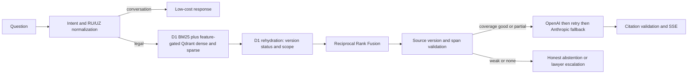

# Architecture

Only server-side code can access provider keys and legal-source credentials. Retrieved
source text is request-scoped unless a separately reviewed source lifecycle publishes it
to the existing D1/R2 evidence model. A disabled or unavailable semantic index falls back
to sparse ranking; it never produces a fabricated source.

JURO now contains a JURO-native, server-only Qdrant REST adapter for named
`dense` and `sparse` vectors. It does not copy the upstream Python client or
Docker deployment, create infrastructure, or activate retrieval. The adapter
is guarded by `LEGAL_CORPUS_DENSE_ENABLED=false`, requires a pre-existing
compatible collection, and rehydrates every candidate from D1 before use. A
real Qdrant deployment and activation still require the reproducible benchmark
and staging infrastructure gate.
