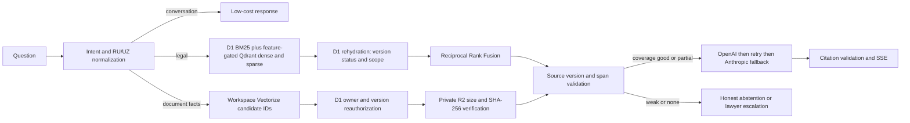

# Architecture

Only server-side code can access provider keys and legal-source credentials. Retrieved
source text is request-scoped unless a separately reviewed source lifecycle publishes it
to the existing D1/R2 evidence model. A disabled or unavailable semantic index falls back
to sparse ranking; it never produces a fabricated source.

JURO now contains a JURO-native, server-only Qdrant REST adapter for named
`dense` and `sparse` vectors. It does not copy the upstream Python client or
Docker deployment, create infrastructure, or activate retrieval. The adapter
is guarded by `LEGAL_CORPUS_DENSE_ENABLED=false`, requires a pre-existing
compatible collection, and rehydrates every candidate from D1 before use. A
real Qdrant deployment and activation still require the reproducible benchmark
and staging infrastructure gate.

User uploads use JURO's existing private-document path, not the legal Qdrant
collection. When `LEGAL_CORPUS_USER_UPLOAD_AUTO_TRUST=true`, the AI route may
query the environment-specific `USER_DOCUMENTS_INDEX`. Vectorize returns only
candidate IDs; D1 then reauthorizes the active workspace, owner/access scope,
latest immutable analysis version and metadata, and private R2 is read only
after byte-size plus SHA-256 verification. The model receives a bounded exact
span without R2 keys, owner/workspace identifiers or file hashes. The gateway
can classify such a span only as a factual `USER_TRUSTED_PRIVATE` claim. It
cannot establish a legal basis, legal deadline, corpus coverage or freshness.
The source card uses a non-public `juro-private:` locator and the authenticated
citation endpoint repeats D1 and R2 validation before returning document text.
