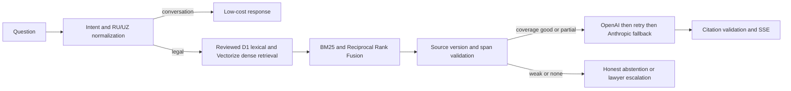

# Architecture

Only server-side code can access provider keys and legal-source credentials. Retrieved
source text is request-scoped unless a separately reviewed source lifecycle publishes it
to the existing D1/R2 evidence model. A disabled or unavailable semantic index falls back
to sparse ranking; it never produces a fabricated source.

Qdrant is not introduced: JURO already has a Cloudflare Vectorize/D1 data plane. A
Qdrant comparison requires a separately reproducible benchmark and deployment decision.
