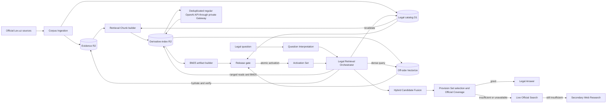

# Custom hybrid target architecture for the Indexed Official Corpus

Status: accepted detailed design; verification simplified by owner direction — 2026-09-05

This architecture implements [ADR 0001](../adr/0001-strict-legal-source-ladder.md), [ADR 0003](../adr/0003-coverage-mapped-legal-provision-retrieval.md), [ADR 0005](../adr/0005-use-source-snapshot-retrieval-eligibility.md), and [ADR 0006](../adr/0006-own-hybrid-official-corpus-retrieval.md). ADR 0006 supersedes ADR 0004's Cloudflare AI Search selection. Source identity remains Source Document → Source Snapshot → Snapshot Provision → Retrieval Eligibility; legacy authority and translation records remain optional audit enrichment, never eligibility gates.

The [verification policy](../operations/legal-corpus-verification.md) controls
operational acceptance. Reuse accepted immutable evidence, check new work once
and keep rollout tests bounded. Repeated corpus replays, routine full remote
restore, fixed observation periods and independent sign-off packages are no
longer required. Runtime evidence checks and complete new-index membership
remain enforced.

## Non-negotiable invariants

1. Evidence R2 is authoritative for immutable official captures, normalized snapshots and Snapshot Provisions. A separate private derivative-index R2 bucket is authoritative for Retrieval Chunks, reusable document embeddings, BM25 artifacts and exhaustive release inventories.
2. D1 owns legal facts, compact candidate-to-evidence mappings, release roots, gates, Activation Sets and rollback history. It owns no canonical body, term dictionary, posting list, position list or vector.
3. Every General Legal Question requires a complete Sparse Candidate Lane and Dense Candidate Lane. Only an explicit unambiguous act-and-provision lookup may bypass them.
4. One sealed Search Release pins both lanes and all policies needed to reproduce them. Missing declared components or partial results make the whole Candidate Packet unavailable.
5. Candidate systems never decide law or provide evidence. D1 revalidates every returned identity and R2 hydrates and hash-verifies every quotation before Provision Set selection.
6. Retrieval Chunk boundaries are deterministic and JURO-owned. Each chunk belongs to exactly one Snapshot Provision; provider behavior never creates canonical chunks.
7. Both lanes prefilter Temporal Scope before top-K. D1 remains final authority for applicability.
8. Activation is atomic by capability through one Activation Set. Active and prior releases are immutable and immediately rollbackable.
9. Provider-bound queries pass the deterministic privacy transform. Query text and vectors are request-local and absent from telemetry, logs and durable caches.
10. Question Interpretation, Coverage Requirements, Provision Sets, Official Coverage, Official Citations, Legal Answer structure and the strict Source Ladder do not change.

## Architecture



The private route-free legal-corpus Worker owns R2, D1, Vectorize and authenticated AI Gateway bindings. The platform reaches it only through the existing private service binding. Provisioning credentials never enter application bindings.

## Storage ownership

### Evidence R2

```text
corpus/raw/lex/<capture-id>/<source-artifact>
corpus/normalized/<source-snapshot-id>.json
corpus/provisions/<source-snapshot-id>/<snapshot-provision-id>.json
corpus-snapshots/<corpus-snapshot-id>/manifest.json
```

These objects are immutable Citation evidence. They retain exact bytes, byte counts, SHA-256 values, publisher identity, capture provenance and stable provision positions. No derivative-index lifecycle may overwrite or delete them.

### Derivative-index R2

```text
search-releases/<release-id>/chunks/<chunk-id>.json
search-releases/<release-id>/sparse/<analyzer>/<segment-id>/manifest.json
search-releases/<release-id>/sparse/<analyzer>/<segment-id>/lexicon-<partition>.bin
search-releases/<release-id>/sparse/<analyzer>/<segment-id>/postings-<partition>.bin
search-releases/<release-id>/sparse/<analyzer>/<segment-id>/doc-stats.bin
search-releases/<release-id>/dense/manifest.json
embeddings/<model>/<dimensions>/<transform>/<content-sha256>.f32
search-releases/<release-id>/manifest.json
```

Retrieval Chunks are structurally split, zero-overlap units with stable parent Snapshot Provision identity and ordinal. The representative prototype compares approximately 512, 1,024 and 2,048-token targets. Every chunk remains below OpenAI's input ceiling; oversized atomic blocks split deterministically at an accepted structural boundary. Adjacent text is hydrated by stable provision order after retrieval, never by duplicated overlap.

Document embeddings are content-addressed immutable Float32 artifacts. Their identity includes model, explicit dimensions, transform version, structured-input hash and vector hash. An unchanged chunk reuses its artifact across releases, so fresh Vectorize can be reconstructed without another OpenAI call.

BM25 artifacts are immutable base or delta segments. Each analyzer records its normalization/tokenization version, release-global document count and average field lengths, document frequencies, field term frequencies, compact document ordinals, applicability data, skip data, block maximums, lexicon partitions, posting byte ranges and hashes. V1 stores no full positions. The prototype selects exact partition/block sizes against R2 request/byte and latency gates.

R2 ranged reads fetch only required lexicon and posting blocks. Cache entries are optional release-hash-keyed optimizations; correctness and availability never depend on cache state.

### Legal D1

D1 retains Source Documents, Source Snapshots, Snapshot Provisions, Retrieval Eligibility, applicability, provenance, lineage, compact evidence locators, Search Release component roots, build/gate results, Activation Sets and rollback events. Exhaustive component inventories and index internals live in R2. A release is blocked when measured projection would put any legal database above 7 GB; a provider-neutral `LegalCatalog` Interface allows deterministic sharding before that threshold rather than after a capacity incident.

## Sparse Candidate Lane

The default analyzer uses Unicode NFKC normalization, locale-independent lowercase and word terms across separate Source Document title/type, article number/title, hierarchy and exact-text fields. BM25 uses release-global statistics. `k1`, `b`, field boosts, token limits and analyzer version are selected on a development set and frozen before the locked release suite.

A character n-gram analyzer challenges word BM25 for misspelling, inflection, transliteration and script recovery. It activates only when word BM25 plus bounded multilingual formulations cannot satisfy a required stratum. If active, word and n-gram rankings first use inner unweighted RRF to form one Sparse Candidate Lane, preventing sparse retrieval from receiving two votes against dense retrieval.

Every declared segment participates. Segment results from one analyzer merge by globally comparable BM25 score while applying release membership and applicability before top-K. A missing segment, lexicon, posting range, manifest, checksum, declared analyzer or complete-disjoint-union proof invalidates the Candidate Packet.

## Dense Candidate Lane

Each Search Release owns one off-side Vectorize index.

| Setting | Value |
| --- | --- |
| Model | `text-embedding-3-large` |
| Dimensions | 1,536, explicit |
| Representation | deterministic Float32 plus L2 normalization |
| Distance | cosine |
| Vector ID | 64-character SHA-256 of canonical Retrieval Chunk identity |
| Returned candidates | at most 50 IDs/ranks/scores with minimal routing metadata |
| Persisted query cache | none |

Structured embedding input contains only Source Document title/type, article number/title, hierarchy, language/script tag and exact official chunk text. URLs, provider/release IDs, applicability dates, authority assumptions and operational metadata are excluded.

Metadata indexes are `language`, `document_type`, `valid_from_epoch` and `valid_to_epoch`. Open-ended applicability uses a documented provider sentinel while canonical D1 remains `null`. Filtering occurs before top-K; D1 revalidates the final interval. Index identity pins environment, capability, Corpus Snapshot, Retrieval Chunk policy, model and release.

Upserts are asynchronous. Promotion waits until the final mutation is processed, then begins a fresh list snapshot and reconciles exact vector IDs, count and metadata against the immutable R2 dense manifest. Count-only parity is insufficient. Missing/unexpected IDs, stale metadata, wrong dimensions/model/distance or an unprocessed mutation blocks sealing.

## Hybrid Candidate Fusion

For each formulation:

1. Merge each BM25 analyzer across all required segments by global BM25 score.
2. If two sparse analyzers are declared, fuse them by unweighted RRF with `k=60` into one sparse ranking.
3. Fuse complete sparse and dense rankings by equal-weight RRF with `k=60`.
4. Combine formulations/languages through JURO's existing outer RRF using stable passage identity.

Raw BM25 and cosine scores are never normalized against one another. Fusion policy, candidate ceilings and tie-breaking are immutable release policy. The in-process ProvisionSetSelector may use channel ranks, lexical agreement, Coverage Requirements, language and bounded legal-graph relations; it adds no model round trip.

## Build and freshness control plane

A private Cloudflare Workflow owns release orchestration. It freezes source identities, creates off-side targets, enqueues deterministic work, waits for durable checkpoints, verifies terminal mutations, evaluates gates and may request activation. Workflow state contains only bounded references, digests and counters.

Queues provide the bounded at-least-once data plane. Messages contain release/lane/batch IDs and R2 locators, never bodies. Consumers verify the pinned release, perform idempotent immutable writes/upserts and commit per-batch inventory roots. Concurrency is limited by provider rate/cost controls. Large or long-lived state always goes to R2.

A Container may perform deterministic external sort/reduce only if the prototype proves Worker CPU, memory or sort constraints inadequate. Container disk is ephemeral: every input, checkpoint and output is R2-backed, and a fresh retry must reproduce the same roots.

Current and historical document builds use the regular OpenAI
`/v1/embeddings` API. Before dispatch, the builder verifies the cutoff-pinned
source/chunk/input/token manifests, reuses every exact hash-verified R2 artifact,
and deduplicates the remaining structured inputs by their full embedding
identity. All chunk-to-input aliases and provenance remain reconstructible.
One durable work identity owns each unique missing input across Queue pages,
concurrent deliveries and restarts.

Bounded multi-input requests traverse the environment-specific authenticated AI
Gateway with logging and caching disabled. The builder enforces per-input,
aggregate-token and input-count limits plus measured account request/token
limits. Durable reservations authorize exact missing tokens at the accepted
standard rate plus 25% before dispatch. Credit exhaustion stops dispatch;
rate-limit retries use bounded backoff. An uncertain provider outcome keeps its
cost reservation pending reconciliation; retries do not assume exactly-once
provider billing.

Responses reconcile by index against the immutable input mapping, with exact
count, model, dimension, finite-vector and usage validation. Verified normalized
embeddings are persisted immutably and read back from R2 before Vectorize
upsert. Completed artifacts are reused after restart. Workflow/Queue checkpoints
retain only identities, locators, hashes, counts, safe states and accounting.
OpenAI Batch and its Files lifecycle are outside this build contract.

Live query formulations also use the regular API, with the existing privacy
transform and separate query/evaluation circuits. Safe formulations are embedded
together when limits permit and reused across comparison endpoints within the
request; query vectors are never persisted as document artifacts.

A current update creates chunks and embeddings only for changed content, emits a new sparse delta, constructs a new off-side Vectorize index largely from reusable embeddings, reconciles the pair and atomically selects a new Search Release. Sparse compaction occurs off-side when measured segment/read/latency limits require it. Active and prior releases are never changed.

## Credentials, privacy and telemetry

The owner-approved OpenAI key in the ignored platform `.env` may bootstrap both environments. Staging and production nevertheless use distinct authenticated AI Gateways and encrypted secret bindings with payload logging and caching disabled. Application Workers receive gateway access, not the raw key. Production real-query embedding remains blocked until disclosure/DPA and approved ZDR/MAM evidence exist.

The ignored root `CLOUDFLARE_API_TOKEN` is a local control-plane bootstrap only. It is never printed, committed, written to evidence or bound to a Worker. It remains until the migration program resolves. The final credential-retirement checkpoint then verifies the pinned account/resources, removes only that entry, deletes the file only when empty, scans for leakage and requires owner revocation.

The provider privacy transform removes direct identifiers, contacts, addresses, account/case/document identifiers, secrets, payment data and irrelevant narrative while preserving material legal facts. Query vectors are request-local and never persisted.

Content-free telemetry may contain release/component/version identities, hashed correlation, counts, R2 operations/bytes/cache state, BM25 traversal/pruning, OpenAI tokens/latency/status, Vectorize latency/results/mutation checkpoint, fusion/revalidation/hydration latency and safe failure/Source Ladder outcomes. It contains no query/evidence text, vectors, postings, secrets or user-linked candidate IDs.

## Release, activation and rollback

The qualified source Corpus Snapshot may source the first custom release, but its draft AI Search Search Release identity may not. Changed chunk, sparse, embedding, Vectorize, filtering and fusion contracts require a new identity and fresh backend gates.

A Search Release seals only after Retrieval Chunks are complete and reproducible; new sparse/embedding writes pass their byte/hash checks; and one exact ID/count/metadata comparison after the final Vectorize mutation confirms the new index inventory. Reuse those results during activation, with a bounded smoke set for the changed capability and the applicable privacy/cost/configuration checks. Unchanged source bodies and prior builds do not need another verification pass.

Current and history are separate releases. Current may activate alone. As-of requires history. Comparison requires compatible current/history releases from the same Corpus Snapshot and policy family. Activation and rollback are single D1 transactions preserving prior sets and immutable events.

AI Search's partial Porter/trigram candidates remain historical non-authoritative evidence until custom staging current activation; the first implementation checkpoint pauses/cancels their jobs with exact readback. Qdrant and legacy D1 remain until the custom replacement works, their active readers/writers are removed and accessible recovery artifacts cover the exact retirement targets. No missing full-corpus Qdrant snapshot may be fabricated: evidence inventories it exactly and proves snapshot mechanics separately.

## Quality targets and focused acceptance

The existing 314 scenarios remain a locked benchmark for retrieval-quality work. BM25 parameters, boosts, analyzer choice, chunk policy and fusion changes use a separate development set. Repeated full benchmark runs are not migration prerequisites; reuse unchanged behavior evidence and apply the bounded capability smoke policy. The following remain quality and latency targets, not percentages that can be inferred from a small smoke sample:

- recall@5 ≥ 0.90, recall@10 ≥ 0.95 and MRR ≥ 0.85;
- citation precision 1.00, citation recall ≥ 0.95, article exactness ≥ 0.95 and document exactness ≥ 0.97;
- abstention correctness ≥ 0.95, partial-answer correctness ≥ 0.90 and groundedness ≥ 0.95;
- zero stale/invalid links and zero integrity/configuration/reconciliation errors;
- source-unavailability rate ≤ 0.02;
- warm hybrid candidate p95 ≤ 1.5 seconds and cold hybrid candidate p95 ≤ 3 seconds;
- complete indexed-stage p95 ≤ 5 seconds and answer p95 ≤ 30 seconds;
- evaluation cost ≤ USD 30.

Fixed staging/canary/stability durations and synthetic-request quotas are removed.
A new capability activates after its build result and bounded smoke checks pass;
ordinary monitoring continues after the ticket closes. An observed failure or
unverified case is recorded and resolved, not concealed by the time limit.

Cost circuits remain USD 50 current build, USD 450 complete migration and USD 25 monthly production query embeddings. Document-build authorization is the exact unique missing token inventory multiplied by the dated accepted standard rate plus 25%; reused and duplicate inputs authorize zero. Exact corpus-wide measurement and any post-cutoff delta control each build, never sample extrapolation. Current releases remain due within 24 hours of a validated change. The four-hour emergency path may reuse matching embeddings or build changed inputs within the same authorization and integrity gates; if a complete release cannot be ready, indexed retrieval becomes unavailable and continues Live Official Search. History reconciles at least weekly.

## Restore contract

The recovery mechanism imports legal D1, opens the pinned BM25 manifest and reconstructs compatible Vectorize solely from hash-verified R2 embeddings, with terminal index membership checks. It never calls OpenAI or relies on container-local disk. Existing proof is reusable for unchanged formats and paths; changed recovery behavior uses bounded fixtures. A full remote restore is for actual recovery or an identified defect, not another routine build/activation/retirement gate.

## Migration sequence

1. Preserve the qualified source snapshot and mark its AI Search qualification non-transferable.
2. Pause/cancel partial AI Search work with exact readback; retain instances/evidence without activation.
3. Prove Retrieval Chunk, BM25, embedding and query-reader contracts on representative current/history data.
4. Build the Workflow/Queue pipeline, adding a Container reducer only if proved necessary.
5. Build staging current once, check the new index once and activate after a bounded smoke set.
6. Migrate missing historical metadata from accepted evidence and resolve only remaining canonical mapping gaps; reuse recovery coverage.
7. Build staging history once, check its new index and activate the new temporal capabilities after focused checks.
8. Copy missing production evidence and reusable embeddings, build each production index once and activate after environment/capability checks.
9. Stop legacy writes and retire unused resources after exact target/reference and recovery-coverage checks; preserve immutable evidence and prior custom releases.
10. Verify final resources, scrub the root Cloudflare token and require owner revocation.

## Verified platform constraints

- [Vectorize limits](https://developers.cloudflare.com/vectorize/platform/limits/) permit 1,536 dimensions, 20 million vectors per index, 1,000-vector Worker-binding or 5,000-vector HTTP upserts and at most 50 returned matches when values/all metadata are returned.
- [Vectorize metadata filtering](https://developers.cloudflare.com/vectorize/reference/metadata-filtering/) applies indexed filters before top-K.
- [Vectorize client API](https://developers.cloudflare.com/vectorize/reference/client-api/) documents asynchronous mutation IDs and delayed visibility.
- [R2 Workers API](https://developers.cloudflare.com/r2/api/workers/workers-api-reference/) supports byte-ranged reads.
- [D1 limits](https://developers.cloudflare.com/d1/platform/limits/) impose a non-increasable 10 GB limit and single-threaded execution per database.
- [Workflows limits](https://developers.cloudflare.com/workflows/reference/limits/) require batched work rather than one step per chunk.
- [Queues delivery guarantees](https://developers.cloudflare.com/queues/reference/delivery-guarantees/) require idempotent consumers.
- [OpenAI embeddings API](https://developers.openai.com/api/reference/ruby/resources/embeddings/methods/create) supports explicit dimensions and bounded multi-input requests.
- [Cloudflare's OpenAI provider-native endpoint](https://developers.cloudflare.com/ai-gateway/usage/providers/openai/)
  replaces the OpenAI base URL, while [AI Gateway authentication](https://developers.cloudflare.com/ai-gateway/configuration/authentication/)
  protects the path. The provider preflight must prove authenticated regular embedding
  requests with payload logging and caching disabled before corpus construction.
- [`text-embedding-3-large`](https://developers.openai.com/api/docs/models/text-embedding-3-large) is the selected multilingual model.
