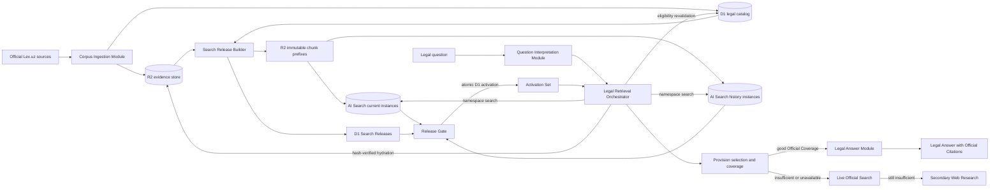

# AI Search target architecture for the Indexed Official Corpus

Status: accepted detailed design; capability-scoped promotion gates apply

This is the final target architecture for general and citation-specific legal research over JURO's complete official corpus. It implements [ADR-0001](../adr/0001-strict-legal-source-ladder.md), [ADR-0003](../adr/0003-coverage-mapped-legal-provision-retrieval.md), and [ADR-0004](../adr/0004-use-ai-search-for-official-corpus-candidates.md).

The architecture is designed so that a General Legal Question such as `можно ли уволить сотрудницу в декрете` searches every official provision eligible for the question, even when those provisions live in several AI Search instances and use different official languages. “Every eligible provision” is scope-sensitive: a current-law question searches the entire current corpus, a point-in-time question searches every version effective at that time, and a comparative question searches both required temporal slices. Superseded and current rules are never silently blended.

## Non-negotiable invariants

1. R2 is the authoritative store for raw captures, normalized legal bodies, and immutable search-release artifacts. AI Search is a disposable candidate index, not the corpus of record.
2. D1 is the authoritative catalog for legal identity, language-family relationships, effective intervals, review state, R2 locators and hashes, release manifests, activation, and rollback. It does not remain the hot store for full bodies or sparse postings.
3. A natural-language question uses sparse and dense candidate channels. Only an explicit, unambiguous act-and-provision citation may bypass them.
4. AI Search never decides the law and never generates a Legal Answer. JURO calls search only.
5. Every candidate is revalidated in D1 and hydrated from R2 with a content-hash check before it can enter a Provision Set.
6. Every material reading of the question becomes a Coverage Requirement or is explicitly rejected. A high-scoring passage is not enough.
7. Every required AI Search shard participates. Missing, stale, partially indexed, or incompatible shards produce indexed Source Unavailability and continue the Source Ladder.
8. Activation is atomic per supported retrieval capability. A current Search Release may activate before history; before indexed comparisons activate, compatible current and history releases from the same Corpus Snapshot are selected together by one Activation Set.
9. Current, point-in-time, and comparative Temporal Scopes are routed deliberately. A date inferred from source freshness is never treated as a legal effective date.
10. General-question safety and coverage are identical in fast and deep modes. They may differ in exposition, not in evidence eligibility.
11. The certified or adopted state-language expression is the Controlling Text. A shared Legal Instrument identity never makes translations co-controlling.
12. AI Search metadata is an efficiency filter only. Every returned item must have exact release membership and metadata parity in D1, then pass R2 byte-count and SHA-256 verification; one integrity failure invalidates the indexed packet.
13. Public legal bodies and provider-bound query text follow separate privacy paths. Raw user wording, direct identifiers, private documents, and case records never enter the official-corpus bucket or index.

## Architecture



## Storage ownership

### R2 evidence store

```text
corpus/raw/lex/<capture-id>/<source-artifact>.<html|pdf|zip>
corpus/normalized/<text-revision-id>.json
corpus/provisions/<text-revision-id>/<provision-rendition-id>.json
search-releases/<release-id>/current/<shard>/<chunk-id>.md
search-releases/<release-id>/history/<shard>/<chunk-id>.md
search-releases/<release-id>/manifest.json
```

The raw layer preserves the complete captured publisher artifact and response metadata. The normalized layer preserves one immutable Text Revision with its structure, textual-authority evidence, source capture hash, and exact official revision token. The provisions layer preserves one Provision Rendition per object so a Legal Answer can hydrate only the evidence it needs. Search-release objects are deterministic, disposable projections; each contains one JURO chunk with:

- Legal Instrument, Official Expression, Text Revision, Provision Concept, Provision Rendition, and chunk identifiers;
- act title, document type, adopting authority, article number/title, and hierarchy;
- BCP-47 language/script tag, textual-authority status, and Legal Instrument identifier;
- exact official provision text;
- Applicability Period when known;
- normalized and provision object keys, byte counts, and SHA-256 values.

Every search artifact stays well below AI Search's 4 MB file limit and below the configured chunk-token ceiling. The release gate expects one AI Search item and normally one AI Search chunk per JURO artifact. If Cloudflare splits an artifact, the build fails unless the split is explicitly represented and every returned piece still maps to the same JURO chunk through `item.key`.

Release prefixes are immutable. A corrected source produces a new Text Revision and Search Release; it never edits the evidence that supported a prior Legal Answer.

### Dedicated D1 legal catalog and release control

D1 retains compact relational facts in a dedicated `LEGAL_CORPUS_DB` for each environment. Tenant, user, workspace, owner, and private-document data remain in the platform D1 database. The legal database contains:

- Legal Instruments and provider aliases;
- Official Expressions with `language_tag`, textual authority, origin, publication status, controlling-on-conflict flag, authority evidence, and derivation edges;
- immutable Text Revisions with the full publisher revision token and a distinct editorial-validity interval;
- stable Provision Concepts and version-bound Provision Renditions;
- sourced Applicability Periods with precision, certainty, and provenance;
- many-to-many provision-lineage edges for unchanged, modified, renumbered, moved, split, merged, and repealed transitions;
- cross-language equivalence, citation, and cross-reference edges;
- provision/chunk ordinals, R2 keys, byte counts, content hashes, and source-normalized hashes—but no canonical body text;
- Official Eligibility findings and temporal coverage gaps;
- Corpus Snapshots, Search Releases, provider instances, shards, builds, evaluations, Activation Sets, activation events, and rollback records.

The current `legal_corpus_documents.id` may seed Legal Instrument identity, but article numbers, route language prefixes, ingestion order, and version-bound provision IDs never establish stable legal identity by themselves. Lex `ONDATE` revision identity retains its full token, including same-day suffixes. Editorial validity and substantive legal applicability are never conflated.

During migration the existing D1 body and sparse-posting tables are a read-only rollback projection. After complete activation has been stable for 90 days and a backup-restore rehearsal passes, full `content_text`, duplicate chunk bodies, and BM25 postings leave the platform database through a forward migration. This restores Locality: legal relationships and transactional state live in the dedicated legal D1 database; bodies live in R2; candidate retrieval lives in AI Search.

### AI Search candidate indexes

Each instance reads exactly one immutable R2 release prefix. The accepted release records:

- AI Search namespace and instance IDs;
- corpus slice and deterministic shard function;
- R2 prefix;
- expected item and chunk counts;
- embedding model and dimensions;
- keyword tokenizer and match mode;
- chunk size and overlap;
- filter schema;
- configuration and corpus hashes;
- successful sync job and pause state;
- evaluation and latency evidence.

Initial settings are:

| Setting                   | Value                                                             |
| ------------------------- | ----------------------------------------------------------------- |
| Index method              | vector and keyword                                                |
| Fusion                    | reciprocal rank fusion                                            |
| Embedding                 | `openai/text-embedding-3-large`, 1,536 dimensions                 |
| Keyword match mode        | `or` for candidate recall                                         |
| Keyword tokenizer         | promoted only after Porter-versus-trigram multilingual evaluation |
| Maximum returned results  | 50 per branch search                                              |
| Query rewriting           | disabled                                                          |
| AI Search reranking       | disabled                                                          |
| AI Search generation      | unused                                                            |
| Context expansion         | disabled; JURO hydrates exact provision windows                   |
| Public endpoint           | disabled                                                          |
| Scheduled synchronization | paused after release verification                                 |
| Gateway payload logging   | disabled                                                          |
| Gateway cache             | disabled                                                          |
| AI Search similarity cache| disabled                                                          |

AI Search exposes only Porter and trigram keyword tokenization, not a language-specific Uzbek or Russian analyzer. Therefore the tokenizer is a versioned release choice, not an assumption. The candidate with better Uzbek Latin, Uzbek Cyrillic, and Russian recall is promoted. If neither single tokenizer meets the gate, each shard gains a keyword-only companion instance using the second tokenizer; the manifest activates both lanes together. With one current shard and four initial history shards, the dual-tokenizer form uses at most ten instances for a current-plus-history comparison, which is the documented cross-instance request limit.

The four occupied custom metadata fields are:

1. `language`
2. `document_type`
3. `valid_from`
4. `valid_to`

The fifth custom field remains deliberately reserved for a measured future need. `language` and `document_type` are `text`; `valid_from` and `valid_to` are `datetime`. Jurisdiction is fixed to Uzbekistan by the dedicated instance, while authority is enforced by the release builder and D1 revalidation instead of a coarse provider rank. Environment, release ID, current/history class, and shard belong in the instance name and R2 prefix. Open-ended effective intervals use a documented far-future sentinel in search metadata while retaining `null` as the canonical D1 value.

The release gate reconciles metadata for 100% of indexed items against D1. Changing the provider metadata schema produces new off-side instances and a full reindex. Prefilter false negatives are therefore release-blocking defects: D1 can reject an ineligible result, but it cannot recover an eligible result that the provider filter hid.

The AI Search Worker is private and route-free. It owns the namespace binding and exposes a narrow service binding to the platform Worker. Provisioning credentials never enter application bindings. Each environment uses a dedicated `LEGAL_CORPUS_BUCKET`, AI Gateway, OpenAI project/service key, AI Search namespace, and legal D1 database. Configuration attestation covers the bucket/prefix, model, dimensions, tokenization, logging, cache, metadata schema, namespace, and service-binding target; drift becomes Source Unavailability.

## Complete-corpus partitioning

The 2026-08-30 staging observations contain approximately 151,499 chunks in the frozen current candidate and approximately 1.30 million stored historical/current chunks. A paid hybrid AI Search instance accepts 500,000 source files. The target layout is therefore:

```text
current release
└── current-00                     approximately 151,499 files

history release
├── history-00                     approximately 325,000 files
├── history-01                     approximately 325,000 files
├── history-02                     approximately 325,000 files
└── history-03                     approximately 325,000 files
```

Three history shards are the mathematical minimum; four are selected to preserve growth and rebuild headroom. Chunk ID hashing assigns each artifact to exactly one shard. The manifest proves that the union is complete and disjoint.

The history release contains every version with a known applicability interval, including the versions duplicated into the optimized current projection. This makes any supported as-of date searchable without guessing which release contains it. Canonical version/chunk identity removes duplicates when a comparative request searches current and history together.

Cloudflare namespace search accepts up to ten instance IDs and returns one ranked result list with an `instance_id` on each chunk. Current questions search `current-00`. Point-in-time questions search all four history instances with endpoint-specific effective-date filters. A comparison performs two independent endpoint searches: `current` uses the current release and a timestamp uses the history release, so history-versus-history is supported without pretending either endpoint is current. The two Provision Sets are never fused. If future growth exceeds ten required instances for one endpoint, the Orchestrator searches deterministic waves of at most ten and performs global reciprocal-rank fusion before D1 revalidation. It never omits a wave silently.

Current and history are separate capability-scoped Search Releases. Current may activate first. Historical activation requires its own gates; indexed comparison activation additionally requires a compatible current/history pair built from the same Corpus Snapshot. The Activation Set records which of `current`, `as_of`, and `comparison` are supported. Unsupported scopes continue to Live Official Search.

## Provider privacy and cost boundary

Public legal-corpus artifacts may be embedded by the accepted provider. User queries cross the provider boundary only after a deterministic privacy transform removes direct names, contacts, addresses, personal/account/case/document identifiers, credentials, payment data, and legally irrelevant narrative while preserving legally material statuses, events, and dates. “Exact wording” in the query policy means exact wording after this transform; raw user text remains inside JURO. A rejected secret-bearing query continues without indexed vector search and is not logged.

Every environment uses a dedicated OpenAI project/service key stored through the AI Gateway/Secrets Store path required by AI Search. Production query embedding requires the approved privacy disclosure and provider data controls, including Zero Data Retention or Modified Abuse Monitoring for `/v1/embeddings`. Until then, staging uses synthetic or explicitly non-personal queries only. JURO records content-free operational metrics: release ID, hashed correlation ID, counts, tokens, latency, provider status, and safe error class. It never records provider payloads, raw queries, evidence bodies, vector values, or user-linked item keys.

Before upload, the builder tokenizes the exact immutable artifacts and stores `embedding_input_tokens` in the signed Search Release manifest. The release budget is `measured_tokens × USD 0.13 / 1,000,000 × 1.25`. Migration circuit breakers are USD 50 for the current release and USD 450 for the complete historical build, including one complete retry; steady production query embeddings have a separate USD 25 monthly circuit breaker. A future AI Search price change requires a new cost attestation before production activation.

## Question Interpretation

The Question Interpretation Module accepts the user's text and returns one bounded, typed plan:

```text
original language
requested answer language
Temporal Scope:
  current
  as-of(timestamp)
  comparison(left: current | timestamp, right: current | timestamp)
actors and legal statuses
action or event
material circumstances
requested outcome
materially plausible readings
Coverage Requirements owned by each plausible reading
search variants by official corpus language
material missing Case Facts
```

Interpretation is not evidence. It may rephrase a user's words into legal-register search language, transliterate, translate query variants, and expose ambiguity, but it cannot establish a rule or exception.

No topic-specific synonym table or hard-coded act/article map is used. The same bounded process must handle employment, family, tax, civil, administrative, criminal, corporate, property, procedural, and other official-law questions.

## General-question retrieval

For a General Legal Question, the Orchestrator performs the following:

1. Resolve the active Activation Set, capability-specific Search Release, and Temporal Scope.
2. Create Coverage Requirements for every materially plausible reading.
3. Produce no more than six total search formulations. At least one preserves the wording after the deterministic provider-boundary privacy transform, and every Plausible Reading gets its first formulation before any reading gets a second. Cross-language recovery and the one repair search remain inside the six-formulation budget. If more than six materially distinct formulations are required, ask a focused clarification.
4. Search every AI Search instance required by the corpus slice. Shards and formulations may run concurrently inside one Indexed Official Corpus endpoint; later Source Ladder tiers do not run speculatively. Comparisons apply the same formulations separately to the left and right endpoints, for at most twelve endpoint-formulation searches.
5. Use AI Search hybrid retrieval with vector and BM25 scores. The union of at most 50 results per variant becomes a candidate pool, deduplicated by canonical chunk and language family.
6. Reserve candidate diversity per Coverage Requirement and plausible reading so one broad concept cannot crowd out conditions or exceptions.
7. Revalidate each candidate's release membership, official status, current/as-of applicability, language family, and R2 hash in D1.
8. Hydrate exact R2 text and provision windows. AI Search text is a locator and ranking aid, not the quoted evidence store. Hydrate at most twelve provisions per endpoint; if complete coverage cannot fit, ask a clarification or return an Insufficient-Evidence Result.
9. Group chunks by provision, add bounded adjacency and citation-graph candidates, and run JURO's versioned semantic reranker.
10. Map the complementary Provision Set to every Coverage Requirement. One candidate-grounded missing requirement may trigger one targeted repair search.
11. If the Provision Set is complete, generate the Legal Answer. If material Case Facts would change the outcome, generate a Conditional Answer. If coverage is incomplete or any required index is unavailable, continue the Source Ladder.

## Worked general-question scenario

Question:

> можно ли уволить сотрудницу в декрете

The architecture must not depend on that phrase occurring verbatim in legislation. It behaves as follows:

1. Detect Russian as the question and preferred answer language.
2. Treat `декрете` as ordinary-language wording whose precise legal status may be ambiguous. It can refer to different leave/protected-status situations, and the initiator and stated ground for termination are also missing.
3. Produce material readings and Coverage Requirements covering the governing termination rule, the applicable protected-status/leave rule, any legally recognized conditions or exceptions surfaced by official candidates, and any material procedure or remedy.
4. Search the full current release with no more than six formulations, including:
   - the exact Russian wording after the deterministic provider-boundary privacy transform;
   - one or more Russian legal-register formulations around termination of an employment relationship and the described leave/status;
   - Uzbek Latin and Uzbek Cyrillic legal-register variants against their matching language filters when linked Russian evidence is absent or incomplete.
5. Use dense retrieval to bridge colloquial and statutory language and BM25 to preserve exact legal terms, article labels, and named statuses.
6. Group linked Official Expressions under their Legal Instrument so translations do not crowd the Provision Set, while preserving each expression's distinct textual authority.
7. Require complementary provisions that cover all material branches. A single passage mentioning leave or dismissal cannot produce a yes/no answer.
8. If the outcome changes based on the exact leave, who initiates termination, or the stated ground, return a Conditional Answer and ask only those material questions. Otherwise return a source-grounded Main Point, What the Law Says, and What to Do Next with provision-specific Official Citations.

The query-specific wording above is an acceptance scenario, not a hard-coded retrieval rule.

## Temporal routing

| Question                               | Corpus slice                  | Required behavior                                                                                          |
| -------------------------------------- | ----------------------------- | ---------------------------------------------------------------------------------------------------------- |
| “What is the law?”                     | Full current release          | Exclude every superseded version before retrieval and revalidate the current pointer in D1                 |
| “What was the law on 2022-06-01?”      | Full history release          | Filter `valid_from <= date < valid_to`; unknown intervals are ineligible and cause a recorded gap          |
| “How did the rule change?”             | Two explicit endpoints        | Search each endpoint separately, including history-versus-history; compare Provision Sets, never fuse them  |
| Date is ambiguous or outcome-sensitive | No guessed scope              | Ask a focused clarification or provide clearly separated Conditional Answers                               |

AI Search filters narrow candidates, but D1 is the final authority for Applicability Periods. A provider metadata mismatch or false-negative risk blocks the release because post-retrieval validation cannot recover a hidden eligible provision.

## Language routing

1. Search the user's language first for discovery, then run bounded cross-language recovery when coverage is incomplete.
2. Link Official Expressions through the Legal Instrument; never infer identity, body language, or authority from provider IDs or URL route prefixes.
3. Record `uz-Latn`, `uz-Cyrl`, `ru`, and `en` separately with textual authority, origin, publication status, derivation, and authority evidence for each Text Revision.
4. Verify every material proposition against the linked Controlling Text. Cite it as the operative evidence and optionally pair it with a clearly labeled Official Translation in the user's language.
5. If only a translation can be retrieved, use it as a locator and hydrate the Controlling Text before claiming good Official Coverage. If that cannot be done, return the evidence limitation.
6. For Uzbek Latin-versus-Cyrillic discrepancies, the certified or adopted expression for that revision controls; a modern script preference never overrides a historical certified original.
7. Transliteration and machine translation are query normalization only. They never become official evidence or silently replace the stored quotation.

## Eligibility, freshness, and evidence retention

Official Eligibility is produced by deterministic provenance, integrity, extraction, scope, textual-authority, and temporal checks; it is not per-document human legal approval. A Text Revision with unknown authority is ineligible. A Provision Concept with unknown applicability may participate in the current capability only when a validated official current pointer covers its expression. It is ineligible for point-in-time and comparison endpoints until sourced applicability evidence exists.

The current Corpus Snapshot must be rebuilt and eligible for activation within 24 hours after JURO validates an official change. An emergency path targets four hours for urgent corrections or newly effective rules. Historical discovery and lineage reconciliation run at least weekly and whenever new historical material is validated. A failed build never moves the Activation Set: the previous indexed release stays active and Live Official Search covers the freshness gap.

Raw captures, normalized revisions, provision renditions, and release manifests use R2 retention locks appropriate to their immutable prefixes. Search chunks are reproducible derivatives and may expire only after their Search Release retention and audit obligations end. No evidence object that supported an emitted Citation is mutated in place.

## Deep module seams

### `QuestionInterpreter`

Small Interface:

```ts
interpret(question, conversationFacts): QuestionInterpretation
```

Its Implementation hides language detection, temporal classification, ambiguity branching, Coverage Requirement derivation, and bounded multilingual search variants. Callers never construct provider queries themselves.

### `LegalCandidateIndex`

Small Interface:

```ts
retrieve(interpretation, endpoint, searchRelease): CandidatePacket
```

The `CandidatePacket` contains stable R2 item keys, instance/shard identity, vector and keyword scoring details, matched readings/requirements, endpoint, release identity, partial-error inventory, and an explicit availability state. It makes no coverage or legal claims. Any required-instance error invalidates the packet even if Cloudflare also returns results.

The current Qdrant/D1 Adapter and the new AI Search Adapter both satisfy this Interface, making the Seam real and providing immediate rollback. Provider configuration, namespace searches, shard waves, retries, result normalization, and the 50-result limit remain inside the Adapter.

### `OfficialEvidenceResolver`

Small Interface:

```ts
resolve(candidates, endpoint, corpusSnapshot, searchRelease): ValidatedProvisionCandidates
```

Its Implementation hides D1 eligibility checks, canonical-family deduplication, R2 hydration, hash verification, exact provision windows, and citation locators. This produces Locality for the central rule that provider results are never evidence by themselves.

### `ProvisionSetSelector`

Small Interface:

```ts
select(interpretation, candidates): ProvisionSelection
```

Its Implementation hides provision grouping, graph expansion, semantic reranking, Coverage Requirement mapping, the bounded repair decision, and context-ceiling behavior. The Interface returns a complete Provision Set, a Conditional Answer basis, a valid rejection, insufficient coverage, or Source Unavailability.

## Edge-case behavior

| Edge case                                              | Required behavior                                                                                                              |
| ------------------------------------------------------ | ------------------------------------------------------------------------------------------------------------------------------ |
| One required shard fails                               | Discard the indexed packet and record Source Unavailability; continue to Live Official Search                                  |
| Sync/index counts differ                               | Block activation; the old manifest remains active                                                                              |
| AI Search returns an unknown or wrong-release item key | Discard the entire packet, record an integrity event, and make the release unavailable; the tolerance is zero                |
| Namespace search returns partial results and errors     | Discard the entire packet and record Source Unavailability even if some shards returned candidates                           |
| Provider metadata differs from D1                       | Block activation or make the active release unavailable; 100% item-level parity is mandatory                                 |
| R2 byte count or hash differs from D1                    | Discard the entire packet, record an integrity event, and make the release unavailable                                        |
| AI Search splits one JURO chunk                        | Block the release unless all pieces map deterministically and the retrieval tests pass                                         |
| More than 50 useful candidates exist                   | Use requirement-specific query variants and one repair pass; never equate top 50 with the Provision Set                        |
| One topic dominates results                            | Enforce per-requirement/per-reading diversity before provision reranking                                                       |
| Current and historical text conflict                   | Keep separate temporal Provision Sets and explain the change; do not average or merge them                                     |
| Applicability evidence is missing                      | Allow current only through an authoritative current pointer; exclude from history, record the gap, and continue the Source Ladder |
| Controlling Text is missing                            | Use translations only as locators; do not claim good Official Coverage until controlling evidence is hydrated                    |
| Colloquial or misspelled wording                       | Preserve privacy-transformed wording plus bounded legal-register, transliterated, and cross-language formulations               |
| Question contains an exact article plus general facts  | Use the exact provision as a required anchor, then perform general retrieval for surrounding rules, conditions, and exceptions |
| Very broad question exceeds the context ceiling        | Ask a focused clarification or return an Insufficient-Evidence Result rather than truncating silently                          |
| AI Search is stale, paused incorrectly, or unavailable | Treat as Source Unavailability; never infer that no law exists                                                                 |
| An applicable official source has not been ingested    | Record insufficient indexed Official Coverage and continue to Live Official Search                                             |
| Private user text resembles legislation                | Keep it in the private Vectorize/R2/D1 path; it cannot enter the Indexed Official Corpus or establish law                      |
| Secondary material conflicts with official law         | Official evidence controls; secondary material cannot establish the legal proposition                                          |
| Cache predates a release                               | Miss the cache because keys include corpus release, tokenizer, embedding, query policy, reranker, Temporal Scope, and language |
| Future corpus needs more than ten instances            | Search deterministic waves and fuse them globally, or introduce a new manifest partition strategy; never drop shards           |
| More than six formulations are materially required     | Ask a focused clarification; do not silently omit a Plausible Reading                                                           |
| More than twelve hydrated provisions are required      | Ask a focused clarification or return an Insufficient-Evidence Result                                                           |
| Query contains secrets or direct identifiers           | Remove them deterministically or reject indexed vector search; never send or log the raw value                                  |
| Provider privacy or spend attestation is absent        | Block production activation while retaining the prior Adapter and Source Ladder                                                 |

## Build, activation, and rollback

1. Before each mutable environment stage, create and verify the prescribed D1 export/restore, R2 manifest-and-hash inventory, provider snapshot where applicable, configuration capture, and local recovery bundle.
2. Freeze an immutable Corpus Snapshot in the dedicated legal D1 database.
3. Export deterministic search artifacts to a new immutable R2 release prefix, tokenize them, record the measured embedding input, and enforce the release budget before provider sync.
4. Create off-side AI Search instances with fixed source prefix, embedding model, tokenizer, chunking, and metadata schema.
5. Trigger sync and enumerate every indexed item and chunk. Compare the complete, disjoint union and 100% metadata parity with the D1 Search Release manifest.
6. Pause scheduled indexing and attest the complete configuration, including logging, caches, gateway/project identity, namespace, source prefix, and service binding.
7. Run retrieval evaluation through authenticated requests to the application, not provider-only probes.
8. Atomically update the capability-scoped Activation Set in D1 and preserve the prior set. Current may activate alone; history and comparison activate only when their own compatibility and evaluation gates pass.
9. Monitor configuration drift, shard availability, partial errors, unknown keys, coverage outcomes, privacy controls, cost, latency, freshness, and Source Ladder escalation.
10. Roll back by selecting the prior Activation Set; no evidence mutation or destructive index operation is needed.
11. Retain previous Search Releases for at least 30 days. Retain Qdrant and the legacy D1 projection until complete current/history/comparison activation has been stable for 90 days and a restore rehearsal passes.
12. Delete only derivative indexes after retention and audit requirements; retain immutable R2 evidence and the manifests required to reproduce cited releases.

## Mandatory release evaluation

The AI Search Adapter cannot activate until it passes:

- exact act-and-provision retrieval;
- Russian, Uzbek Latin, Uzbek Cyrillic, and English general questions;
- cross-language recovery where one official variant is missing;
- colloquial-to-legal-register questions, including `можно ли уволить сотрудницу в декрете` and equivalent Uzbek formulations;
- ambiguity that must produce a Conditional Answer;
- employment, family, tax, civil, administrative, criminal, corporate, property, and procedural breadth;
- current, point-in-time, and comparative Temporal Scopes;
- governing rule plus conditions/exceptions and procedure/remedy coverage;
- long provisions, neighboring provisions, references, and split-chunk detection;
- typo, transliteration, inflection, and named-act queries;
- irrelevant/adversarial content and instruction-like source text;
- missing shard, stale index, partial sync, unknown key, D1 failure, R2 failure, and hash mismatch;
- cold/warm and fast/deep matrices;
- exact item/chunk reconciliation;
- 100% D1/R2/item-key/metadata reconciliation with zero unknown keys, wrong-release keys, hash mismatches, partial responses, or configuration drift;
- every required stratum in the existing 314-scenario evaluation matrix;
- recall@5 at least 0.90, recall@10 at least 0.95, MRR at least 0.85, citation precision 1.00, citation recall at least 0.95, article exactness at least 0.95, document exactness at least 0.97, abstention correctness at least 0.95, partial-answer correctness at least 0.90, groundedness at least 0.95, and zero stale or invalid links;
- source unavailability at most 0.02, indexed-stage p95 at or below five seconds, end-to-end answer p95 at or below 30 seconds, and provider evaluation cost at or below USD 30;
- fourteen continuous staging days and at least 10,000 shadow or synthetic requests without a gate breach;
- production canary followed by 30 stable days before complete activation.

Porter and trigram candidates run the same matrix. Promotion is based on proposition-complete Official Coverage and failure safety first, then latency and cost. A tokenizer or model that improves average relevance but loses a required legal branch is rejected.

## Migration sequence

1. Create and verify the local recovery bundle before implementation.
2. Add the dedicated legal D1 schema, separate platform/legal database boundary, and forward-only metadata migration tooling; never copy bodies into the new D1 database.
3. Export every raw capture, normalized Text Revision, and Provision Rendition into the dedicated legal-corpus R2 bucket with byte counts, hashes, retention locks, and reconciliation evidence.
4. Migrate legal identities, Official Expressions, authority evidence, Text Revisions, Applicability Periods, provision concepts/renditions, lineage/equivalence edges, and R2 locators into the legal D1 database. Preserve unresolved temporal/authority gaps explicitly.
5. Introduce the route-free legal-corpus Worker, service binding, `LegalCandidateIndex` Seam, AI Search Adapter, D1 revalidation, and R2 hash-verified hydration without changing visible answers.
6. Remove topic-specific interpretation rules and introduce typed Plausible Readings, proposition-level Coverage Requirements, privacy-transformed bounded formulations, arbitrary temporal endpoints, and per-endpoint Provision Sets.
7. Build and attest the frozen current Search Release from the approximately 151,499-chunk candidate. Evaluate Porter and trigram in staging shadow mode and activate only the winner after all current gates and backups pass.
8. Build the approximately 1.30-million-chunk historical Search Release in four deterministic shards, validate point-in-time and history-versus-history behavior, then activate history and compatible comparisons through an Activation Set.
9. Meet the staging soak, production canary, production stability, freshness, privacy, cost, and rollback gates while keeping Qdrant and the legacy D1 projection available.
10. After complete activation has remained stable for 90 days, create fresh verified backups and run an isolated restore rehearsal.
11. Stop legacy body/sparse writes, remove legacy D1 body/posting tables through a forward migration, and retire Qdrant snapshot/reconciliation/container machinery.
12. Keep direct Vectorize for private user documents and internal material with independent access and trust predicates; retain R2 legal evidence and reproducible Search Release manifests.

## Verified Cloudflare constraints

These constraints were rechecked against Cloudflare's primary documentation on 2026-08-30:

- [AI Search hybrid retrieval](https://developers.cloudflare.com/ai-search/configuration/indexing/hybrid-search/) runs vector and BM25 keyword search and exposes both channel ranks and scores.
- [AI Search keyword configuration](https://developers.cloudflare.com/ai-search/configuration/indexing/keyword-search/) offers Porter or trigram tokenization and `and`/`or` match modes.
- [AI Search cross-instance search](https://developers.cloudflare.com/ai-search/api/search/rest-api/) accepts instance IDs at namespace scope and returns one ranked list identifying the source instance.
- [AI Search limits](https://developers.cloudflare.com/ai-search/platform/limits-pricing/) allow 500,000 files per paid hybrid instance, 4 MB per file, five custom metadata fields, 50 returned chunks, and ten instances per cross-instance request.
- [AI Search R2 indexing](https://developers.cloudflare.com/ai-search/configuration/data-source/r2/) supports path filtering and R2 custom metadata.
- [AI Search metadata](https://developers.cloudflare.com/ai-search/configuration/indexing/metadata/) supports typed custom fields and requires a full reindex when the schema changes.
- [AI Search synchronization](https://developers.cloudflare.com/ai-search/configuration/indexing/syncing/) supports triggered sync, individual-file sync, pause, and resume.
- [AI Search supported models](https://developers.cloudflare.com/ai-search/configuration/models/supported-models/) includes `openai/text-embedding-3-large` at 1,536 dimensions.
- [AI Search model routing](https://developers.cloudflare.com/ai-search/configuration/models/ai-gateway/) sends indexing and query model calls through the connected AI Gateway and warns against Gateway caching.
- [AI Gateway logging](https://developers.cloudflare.com/ai-gateway/observability/logging/) collects request and response payloads by default, so the dedicated search gateways disable it.
- [OpenAI API data controls](https://developers.openai.com/api/docs/guides/your-data) document no training by default, possible abuse-monitoring retention, and Zero Data Retention eligibility for embeddings.
- [OpenAI embedding pricing](https://developers.openai.com/api/docs/models/text-embedding-3-large) prices `text-embedding-3-large` input at USD 0.13 per million tokens.
- [D1 limits](https://developers.cloudflare.com/d1/platform/limits/) cap a paid database at a non-increasable 10 GB and document single-threaded execution per database.
- [R2 limits](https://developers.cloudflare.com/r2/platform/limits/) allow unlimited storage and object count per bucket.
- [R2 bucket locks](https://developers.cloudflare.com/r2/buckets/object-locks/) prevent overwrite or deletion under protected prefixes.
- [Uzbekistan's Law on Normative Legal Acts, Article 33](https://lex.uz/docs/5378966) establishes the state-language text as controlling when translations conflict; Article 36 requires certification of the official text.
